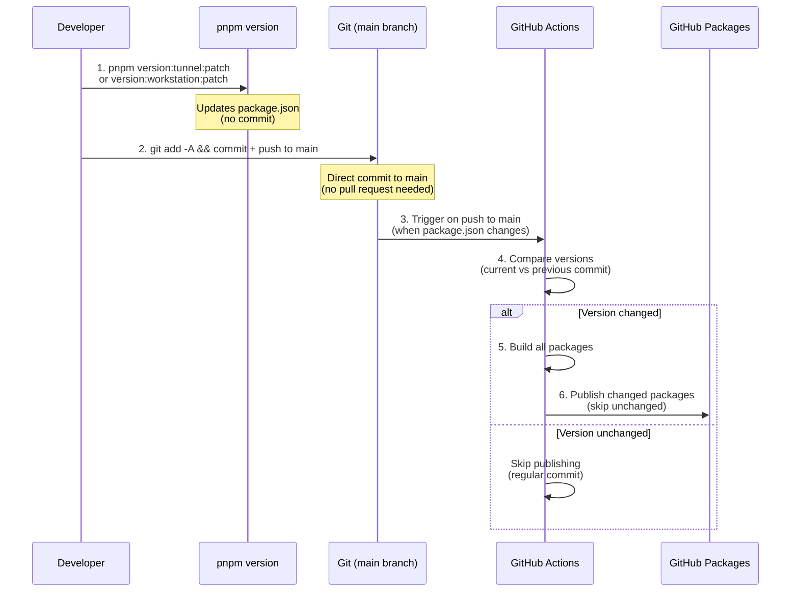
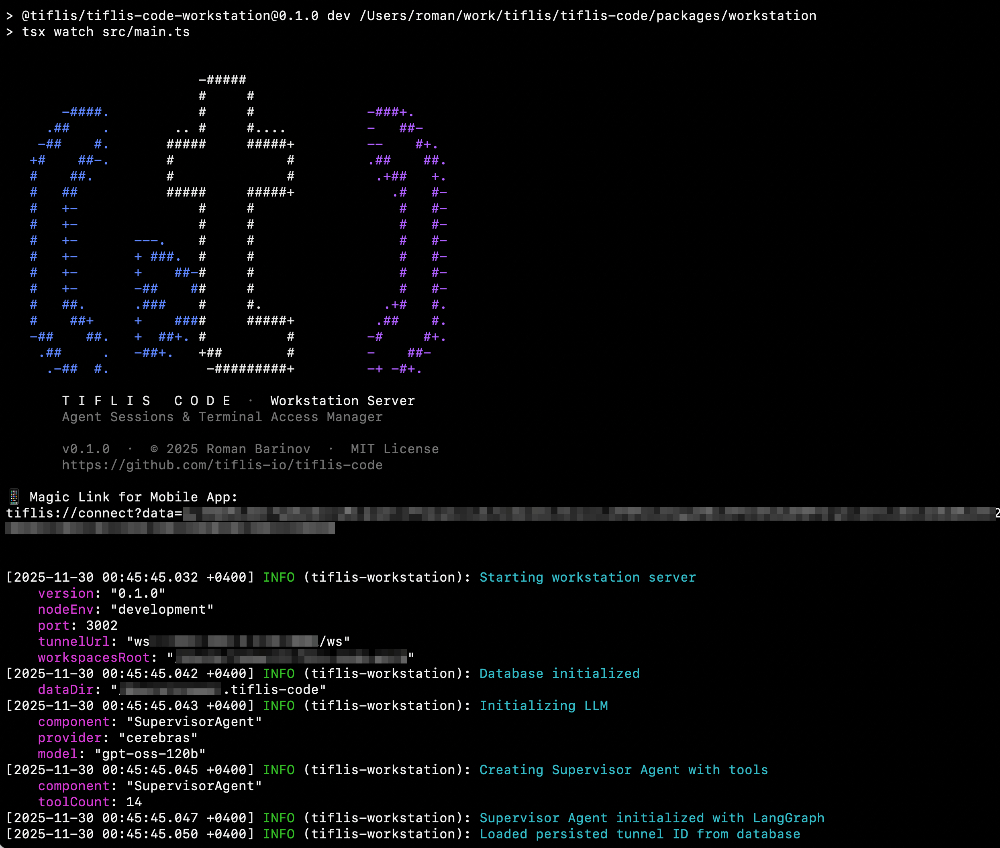

# 📘 Tiflis Code — Project Guide

<p align="center">
  
</p>

<p align="center">
  <strong>Complete development guide for contributors and AI agents</strong>
</p>

<p align="center">
  <a href="#project-overview">Overview</a> •
  <a href="#system-architecture">Architecture</a> •
  <a href="#ios-watchos-development-stack">iOS Stack</a> •
  <a href="#typescript-nodejs-development-stack">Node.js Stack</a> •
  <a href="#local-development-setup">Setup</a>
</p>

---

## Project Overview

**Project Name:** `tiflis-code` (lowercase, hyphen-separated, Latin characters only)

**tiflis-code** is a comprehensive suite of applications designed to provide users with seamless remote access to their workstation through a secure network tunnel deployed on a remote server. The system enables voice-controlled interaction with AI agents running on the user's workstation from mobile devices.

### ✨ Key Capabilities

- 🎤 **Voice-First** — Dictate commands to AI agents from anywhere
- 🤖 **Multi-Agent** — Run Cursor, Claude Code, OpenCode simultaneously
- 📱 **Mobile & Watch** — Native iOS and watchOS apps
- 💻 **Terminal Access** — Full PTY terminal in your pocket
- 🔐 **Self-Hosted** — Your code never leaves your machine
- 🌐 **Tunnel-Based** — No public IP required

### Core Components

| Component | App Name | Display Name | Platform | Technology Stack |
|-----------|----------|--------------|----------|------------------|
| Mobile Application | `TiflisCode` | Tiflis Code | iOS | Swift, SwiftUI |
| Watch Application | `TiflisCodeWatch` | Tiflis Code | watchOS | Swift, SwiftUI |
| Tunnel Server | `tiflis-code-tunnel` | — | Remote Server | TypeScript, Node.js |
| Workstation Service | `tiflis-code-workstation` | — | User's Machine | TypeScript, Node.js |

### Naming Conventions by Platform

| Context | Convention | Example |
|---------|------------|---------|
| Swift App (iOS/watchOS) | PascalCase | `TiflisCode`, `TiflisCodeWatch` |
| TypeScript Project Folder | kebab-case | `tiflis-code-tunnel`, `tiflis-code-workstation` |
| Bundle Identifier (Apple) | Reverse DNS + PascalCase | `com.tiflis.TiflisCode` |
| npm Package | scoped kebab-case | `@tiflis-io/tiflis-code-tunnel`, `@tiflis-io/tiflis-code-workstation` |

### Key Features

- **Remote Agent Control**: Manage multiple AI agents on your workstation from anywhere
- **Voice Interaction**: Dictate commands and receive synthesized voice responses
- **Multi-Agent Support**: Run and supervise multiple agent sessions simultaneously
- **Interactive Chat Interface**: Real-time text and voice communication with agents
- **Direct Shell Access**: Optional terminal session for direct command execution

### Interaction Modes

The system provides three primary ways to interact with the workstation:

#### 1. Supervisor Agent
The central orchestrator running on the workstation that manages all sessions and project structure. Users communicate with the Supervisor to:
- **Session Lifecycle**: Create and terminate headless agent sessions and terminal sessions within specific project directories
- **Project Discovery**: List available workspaces, their nested projects, and existing git worktrees for each project
- **Git Worktree Management**: List, create, or remove [git worktrees](https://git-scm.com/docs/git-worktree) for a specific project

> **Workspace Structure**: The workstation organizes code in a two-level hierarchy:
> - **Workspaces** (top-level folders) — represent organizations or groups
> - **Projects** (flat structure inside workspace) — cloned git repositories and their worktrees
>
> **Worktree Naming Convention**: To distinguish between main repositories and worktrees, use the `--` (double hyphen) suffix pattern:
> ```
> workspace/
> ├── my-app/                      # main repository (default branch)
> ├── my-app--feature-auth/        # worktree for feature/auth branch
> ├── my-app--bugfix-login/        # worktree for bugfix/login branch
> └── another-project/             # another main repository
> ```
> This flat structure keeps all project folders at the same level while clearly indicating the relationship between a worktree and its parent repository.

#### 2. Headless Agent Sessions
Interactive AI coding assistant sessions running in headless mode. Each session connects to one of the supported agents:

| | Agent | CLI Tool | Documentation |
|:---:|-------|----------|---------------|
|  | Cursor | `cursor-agent -p` (non-interactive/print mode) | [cursor.com/docs/cli/overview](https://cursor.com/docs/cli/overview) |
|  | Claude Code | `claude -p` (headless/print mode) | [code.claude.com/docs/en/headless](https://code.claude.com/docs/en/headless) |
|  | OpenCode | `opencode serve` + `opencode run --attach` | [opencode.ai/docs/cli](https://opencode.ai/docs/cli/) |

> **OpenCode architecture**: A single `opencode serve` instance runs on the workstation, and multiple headless agents connect to it via `opencode run --attach http://localhost:PORT`.

Multiple agent sessions can run simultaneously, each handling independent tasks.

#### 3. Terminal Session
Direct shell access to the workstation for executing commands. Useful for:
- Running scripts and CLI tools
- System administration tasks
- Quick commands that don't require an AI agent

---

## System Architecture

### Network Topology

```
┌─────────────────┐         ┌─────────────────┐         ┌─────────────────────┐
│  Mobile Client  │◄───────►│  Tunnel Server  │◄───────►│  Workstation Server │
│  (iOS/watchOS)  │   WS    │     (VPS)       │   WS    │   (User's Machine)  │
└─────────────────┘         └─────────────────┘         └─────────────────────┘
```

### Components

| Component | Role |
|-----------|------|
| **Mobile Client** | User interface for voice/text interaction with agents |
| **Tunnel Server** | Reverse proxy with authentication, enables access without public IP |
| **Workstation Server** | Executes agents, manages sessions, processes STT/TTS |

### Communication

All network communication uses a **unified WebSocket protocol** with:
- Single multiplexed connection per client
- Session subscription model
- Automatic reconnection with state recovery
- Heartbeat-based connection health monitoring

> 📖 **Protocol Specification**: See [PROTOCOL.md](PROTOCOL.md) for the complete WebSocket protocol documentation.

### Endpoints

Each server exposes minimal endpoints:

| Server | HTTP | WebSocket |
|--------|------|-----------|
| Tunnel Server | `GET /health` | `/ws` |
| Workstation Server | `GET /health` | `/ws` |

---

## Mobile Application UI Design

### Design Philosophy

The mobile application UI is inspired by modern minimalist design principles:

- **[shadcn/ui](https://ui.shadcn.com/)** — Clean, accessible component design with consistent spacing and typography
- **[shadcn/ai](https://www.shadcn.io/ai)** — Purpose-built patterns for conversational AI interfaces (streaming responses, message bubbles, tool displays)
- **Apple Human Interface Guidelines** — Native iOS/watchOS patterns and conventions

The app supports **both light and dark themes**, automatically following the system preference.

> 📖 **Detailed Implementation**: See [docs/MOBILE_APP_LOGIC.md](docs/MOBILE_APP_LOGIC.md) for complete documentation of navigation patterns, state management, and UI component behavior.

### App Structure Overview

```
┌─────────────────────────────────────────────────────────────────┐
│                         iOS App Layout                          │
├─────────────────────────────────────────────────────────────────┤
│                                                                  │
│  ┌────────────────┐    ┌──────────────────────────────────────┐ │
│  │    Sidebar     │    │  ┌──────────────────────────────────┐ │ │
│  │                │    │  │  ☰ │ Title      ● │ [⋮]          │ │ │
│  │ ┌────────────┐ │    │  │    │ Subtitle     │              │ │ │
│  │ │ Header [+] │ │    │  └──────────────────────────────────┘ │ │
│  │ └────────────┘ │    │  ┌──────────────────────────────────┐ │ │
│  │                │    │  │                                  │ │ │
│  │ ┌────────────┐ │    │  │         ChatView                 │ │ │
│  │ │ Supervisor │ │    │  │    (Supervisor / Agent)          │ │ │
│  │ └────────────┘ │    │  │                                  │ │ │
│  │                │    │  │  • Message history               │ │ │
│  │ ── Sessions ── │    │  │  • Streaming responses           │ │ │
│  │                │    │  │  • Voice/text input              │ │ │
│  │ ┌────────────┐ │    │  │                                  │ │ │
│  │ │ 🤖 Claude  │ │    │  └──────────────────────────────────┘ │ │
│  │ │   proj-x   │ │    │                                        │ │
│  │ └────────────┘ │    │              — or —                    │ │
│  │ ┌────────────┐ │    │                                        │ │
│  │ │ 💻 Terminal│ │    │  ┌──────────────────────────────────┐ │ │
│  │ └────────────┘ │    │  │        TerminalView              │ │ │
│  │                │    │  │   (PTY session, SwiftTerm)       │ │ │
│  │ ────────────── │    │  └──────────────────────────────────┘ │ │
│  │                │    │                                        │ │
│  │ ┌────────────┐ │    │              — or —                    │ │
│  │ │ ⚙ Settings │ │    │                                        │ │
│  │ └────────────┘ │    │  ┌──────────────────────────────────┐ │ │
│  │                │    │  │        SettingsView              │ │ │
│  └────────────────┘    │  │   • Connection management        │ │ │
│                        │  │   • Voice/TTS preferences        │ │ │
│                        │  └──────────────────────────────────┘ │ │
│                        └──────────────────────────────────────┘ │
└─────────────────────────────────────────────────────────────────┘
```

### Main Views

| View | Description |
|------|-------------|
| **ChatView** | Unified chat interface for Supervisor and Headless Agent sessions |
| **TerminalView** | Full PTY terminal emulator using [SwiftTerm](https://github.com/migueldeicaza/SwiftTerm) library |
| **SettingsView** | Connection management and app preferences |
| **Sidebar** | Navigation between sessions with quick session creation |

### Navigation Header

A static header bar appears on all content screens, providing context and quick actions.

#### Header Structure

```
┌─────────────────────────────────────────────────────────────────┐
│  [☰]  │  Session Title                    [●] │  [⋮]           │
│       │  Subtitle / Context                   │                │
└─────────────────────────────────────────────────────────────────┘
   │              │                          │        │
   │              │                          │        └── Overflow menu
   │              │                          └── Connection indicator
   │              └── Session info (title + subtitle)
   └── Sidebar toggle (hamburger menu)
```

#### Header Content by View

| View | Title | Subtitle | Menu Actions |
|------|-------|----------|--------------|
| **Supervisor** | "Supervisor" | — | Clear Context |
| **Headless Agent** | Agent name (Claude/Cursor/OpenCode) | `workspace/project--worktree` | Session Info, Terminate Session |
| **Terminal** | "Terminal" | Working directory path | Clear Terminal, Terminate Session |
| **Settings** | "Settings" | — | — |

#### Connection Status Indicator

A colored dot indicator is **always visible** in the header on all screens:

| State | Indicator | Color |
|-------|-----------|-------|
| **Connected** | ● | Green |
| **Connecting** | ◐ (animated) | Yellow |
| **Disconnected** | ○ | Gray |
| **Error** | ● | Red |

Tapping the indicator shows a popover (320pt wide) with:
- **Connected state**: Information displayed in order:
  1. Connection status (circle indicator + text)
  2. Workstation name (from server via `auth.success`)
  3. Tunnel URL (full URL with protocol)
  4. Tunnel ID
  5. Tunnel Version (tunnel server version with tunnel's protocol version inline, e.g., "0.1.0 (1.0.0)")
  6. Workstation Version (workstation server version with workstation's protocol version inline, e.g., "0.1.0 (1.0.0)")
  7. Disconnect button (with confirmation dialog)
- **Disconnected state**: "Scan QR Code" and "Paste Magic Link" buttons for quick connection

#### Adaptive Navigation

The app uses **different navigation patterns** based on device:

| Device / Orientation | Navigation Pattern | Sidebar Behavior |
|---------------------|-------------------|------------------|
| **iPhone (any)** | Custom full-screen drawer | Swipe from left edge to open, covers entire screen |
| **iPad Portrait** | `NavigationSplitView` | Overlay sidebar |
| **iPad Landscape** | `NavigationSplitView` | Persistent sidebar |

##### iPhone Drawer Navigation

On iPhone, the sidebar opens as a **full-screen drawer** with gesture support:

| Gesture | Action |
|---------|--------|
| Swipe right from left edge (20pt) | Open drawer (strict check - only from left edge) |
| Swipe left anywhere when open | Close drawer |
| Tap `☰` button in toolbar | Open drawer |
| Tap already-selected item | Close drawer |

**Important:** The drawer **only opens** when swiping from the left edge (20pt). Swipes from other areas are ignored to prevent accidental opening.

**Hit Testing:** The drawer uses `allowsHitTesting` to ensure buttons work correctly:
- Main content is disabled when drawer is open
- Drawer buttons are enabled only when drawer is actually visible (at least 90% on screen)
- Uses position-based check: `drawerOffsetValue(drawerWidth: drawerWidth) > -drawerWidth * 0.9` instead of just state flag

The drawer automatically closes when:
- User selects a different session
- User taps on the already-selected session (acts as "close")

##### iPad Split View Navigation

On iPad, standard `NavigationSplitView` is used with balanced layout:
- Sidebar can be toggled via `☰` button or swipe
- In landscape, sidebar is persistent

### Sidebar Navigation

The sidebar serves as the primary navigation hub:

| Element | Behavior |
|---------|----------|
| **Header** | "Tiflis Code" title + `[+]` button for creating new sessions |
| **Supervisor** | Always visible at top; single persistent session per workstation |
| **Sessions List** | All active sessions from the workstation (grouped by type) |
| **Settings** | Fixed at bottom of sidebar; opens as separate page (not within sidebar) |

#### Selection Indicator

The currently active item in the sidebar displays a **checkmark** (✓) next to it. Tapping on an already-selected item closes the sidebar menu (on iPhone).

**Button Clickability:** All sidebar buttons must be fully clickable across their entire row width, including empty areas on the right. This is achieved by:
- Adding `.frame(maxWidth: .infinity, alignment: .leading)` to `SessionRow` to fill the entire width
- Adding `.contentShape(Rectangle())` to the button label to make the entire rectangular area tappable
- This ensures buttons work even when content is sparse (e.g., short session names)

**Session Subscription Logic:**
- Entering a session → automatically subscribes to session events
- Leaving a session → automatically unsubscribes from session events
- All sessions remain visible in sidebar regardless of subscription state

**Session Icons:**

| Session Type | Icon Source | Description |
|--------------|-------------|-------------|
| Supervisor | Custom Image | Tiflis Code logo (`TiflisLogo`) |
| Cursor | Custom Image | Cursor app logo (`CursorLogo`) |
| Claude | Custom Image | Claude/Anthropic logo (`ClaudeLogo`) |
| OpenCode | Custom Image (theme-aware) | OpenCode logo, switches between light/dark variants |
| Terminal | SF Symbol | `apple.terminal.fill` |

### Session Creation

Sessions can be created in two ways:

#### 1. Via UI (Quick Action)

Tapping `[+]` in sidebar header opens a creation sheet with:

1. **Session Type Selection** — Radio-style selection with icons for each type
2. **Project Selection** (for agents only) — Two cascading pickers:
   - **Workspace** dropdown — Select from available workspaces
   - **Project** dropdown — Populated based on selected workspace

| Session Type | Required Selection |
|--------------|-------------------|
| **Terminal** | None (working directory defaults to workspace root) |
| **Cursor / Claude / OpenCode** | Workspace (required) → Project (required) → Worktree (optional) |

#### 2. Via Supervisor (Natural Language)

Users can ask the Supervisor to create sessions through conversational commands:
- *"Create a new Claude session in tiflis/tiflis-code"*
- *"Open a terminal in my home directory"*
- *"Start Cursor agent for the feature-auth worktree"*

### Supervisor Session

The Supervisor is a **singleton session** per workstation connection:
- Always available as the first item in sidebar
- Manages other sessions via natural language or protocol commands
- **Context Management**: Supports clearing conversation history (context reset clears both agent memory and visible chat history in the app)
- Powered by LangChain/LangGraph running inside the Workstation Server

### ChatView Components

Inspired by [shadcn/ai components](https://www.shadcn.io/ai):

| Component | Description |
|-----------|-------------|
| **ChatEmptyState** | Displayed when no messages exist — shows agent icon, name, working directory, and invitation message |
| **MessageBubble** | Role-based styling (user/assistant), markdown rendering, streaming support |
| **VoiceMessageBubble** | Audio waveform display for voice input before transcription |
| **TranscriptionMessage** | Displayed after voice input is transcribed |
| **AudioResponseAttachment** | Synthesized TTS audio player attached to agent responses |
| **PromptInputBar** | Text input + voice button + send button |
| **TypingIndicator** | Visual feedback while agent is processing |
| **ToolCallDisplay** | Collapsible display for agent tool invocations (optional) |

#### Empty State Messages

When no messages exist in a chat session, an empty state is displayed with context-specific invitation:

| Session Type | Invitation Message |
|-------------|-------------------|
| **Supervisor** | "Ask me to create sessions, manage projects, or explore your workspaces" |
| **Claude/Cursor/OpenCode** | "Send a message to start coding with AI assistance" |
| **Terminal** | (no message — terminal uses different UI) |

### Voice Interaction Flow

#### User Voice Input

```
┌─────────────────────────────────────────────────────────────┐
│  1. User taps/holds 🎤 button                                │
│  2. Recording starts → VoiceMessageBubble appears           │
│     (shows audio waveform in real-time)                     │
│  3. User releases/taps again to stop                        │
│  4. Audio sent to backend for STT                           │
│  5. TranscriptionMessage appears below VoiceMessageBubble   │
│  6. Command executed by agent                               │
└─────────────────────────────────────────────────────────────┘
```

#### Agent Voice Response

```
┌─────────────────────────────────────────────────────────────┐
│  1. Agent responds with streaming text messages             │
│  2. When response is complete (is_complete: true):          │
│     - If TTS enabled: audio synthesized on backend          │
│     - AudioResponseAttachment added to final message        │
│  3. In interactive mode: audio auto-plays immediately       │
│  4. User can replay audio via attachment player             │
└─────────────────────────────────────────────────────────────┘
```

### Voice Input UX

The microphone button supports two interaction modes:

| Mode | Gesture | Behavior |
|------|---------|----------|
| **Toggle** | Tap | Start recording → Tap again to stop and send |
| **Push-to-talk** | Long press | Record while holding → Release to stop and send |

Both modes are available simultaneously — the system detects the gesture type.

**Future enhancement**: Voice Activity Detection (VAD) for automatic end-of-speech detection (planned for later releases).

### TerminalView

Full terminal emulation using [SwiftTerm](https://github.com/migueldeicaza/SwiftTerm):

- Complete PTY support with ANSI escape sequences
- Keyboard input with iOS keyboard or external keyboard
- Resize handling synchronized with backend
- Copy/paste support
- Scrollback buffer

### SettingsView

Settings opens as a **separate page** (not within the sidebar menu) and includes:

#### Connection Section

| State | Content |
|-------|---------|
| **Connected** | Information displayed in order: 1) Connection status, 2) Workstation name (from server), 3) Tunnel URL (full URL with protocol), 4) Tunnel ID, 5) Tunnel Version (tunnel server version with tunnel's protocol version inline, e.g., "0.1.0 (1.0.0)"), 6) Workstation Version (workstation server version with workstation's protocol version inline, e.g., "0.1.0 (1.0.0)"), 7) Disconnect button (with confirmation) |
| **Disconnected** | "Scan QR Code" button, "Paste Magic Link" button |

#### Voice & Speech Section

| Option | Description |
|--------|-------------|
| **Text-to-Speech** | Toggle for TTS audio responses |
| **Speech Language** | Picker with English and Russian options |

#### About Section

| Item | Value |
|------|-------|
| Version | App version and build number |
| Author | Roman Barinov |
| GitHub Repository | Link to `github.com/tiflis-io/tiflis-code` |
| License | MIT |

#### Legal Section

| Link | Destination |
|------|-------------|
| Privacy Policy | `PRIVACY.md` in repository |
| Terms of Service | `TERMS.md` in repository |

**Connection Setup**: Initial configuration via QR code scan or magic link paste. Magic link format: `tiflis://connect?data=<base64_encoded_json>` where the JSON payload contains `tunnel_id`, `url`, and `key` (see [PROTOCOL.md § QR Code Payload](PROTOCOL.md#11-qr-code--magic-link-payload)). The `tunnel_id` is the persistent workstation identifier that enables proper routing.

---

## watchOS Application

The watchOS app is a **simplified companion** focused on voice interaction.

### watchOS App Structure

```
┌─────────────────────────────────┐
│        watchOS App              │
├─────────────────────────────────┤
│                                 │
│  ┌───────────────────────────┐  │
│  │     SupervisorView        │  │
│  │  • Voice input button     │  │
│  │  • Recent messages        │  │
│  │  • Quick actions          │  │
│  └───────────────────────────┘  │
│              │                  │
│              ▼                  │
│  ┌───────────────────────────┐  │
│  │     SessionListView       │  │
│  │  • Active agent sessions  │  │
│  │  • Tap to open chat       │  │
│  └───────────────────────────┘  │
│              │                  │
│              ▼                  │
│  ┌───────────────────────────┐  │
│  │     AgentChatView         │  │
│  │  • Voice interaction      │  │
│  │  • Message history        │  │
│  │  • Audio playback         │  │
│  └───────────────────────────┘  │
│                                 │
└─────────────────────────────────┘
```

### watchOS Features

| Feature | Supported |
|---------|-----------|
| Supervisor voice interaction | ✅ |
| Headless Agent voice interaction | ✅ |
| Session list navigation | ✅ |
| Terminal sessions | ❌ (not practical on watch) |
| Manual session creation | ❌ (use Supervisor or iOS app) |
| Settings configuration | ❌ (synced from iOS via WatchConnectivity) |

### watchOS-iOS Synchronization

Configuration is shared from the iOS app using **WatchConnectivity**:

| Data | Sync Direction |
|------|----------------|
| Tunnel URL | iOS → watchOS |
| Auth Key | iOS → watchOS |
| Voice settings (language, TTS) | iOS → watchOS |
| Active sessions list | Workstation → Both |

---

## iOS & watchOS Development Stack

### Technology Stack

#### Core Frameworks (Apple)

| Framework | Purpose |
|-----------|---------|
| **SwiftUI** | Declarative UI framework for all views |
| **Swift Concurrency** | async/await, actors, structured concurrency for all async operations |
| **Combine** | Reactive streams where SwiftUI bindings require it |
| **AVFoundation** | Audio recording, playback, and session management |
| **Speech** | Speech-to-text (on-device or server-side) |
| **WatchConnectivity** | iOS ↔ watchOS data synchronization |
| **Security** | Keychain access for secure credential storage |
| **Network** | Network path monitoring, WebSocket via URLSessionWebSocketTask |

#### Third-Party Libraries

| Library | Purpose | Source |
|---------|---------|--------|
| **SwiftTerm** | Terminal emulation (PTY rendering) | [migueldeicaza/SwiftTerm](https://github.com/migueldeicaza/SwiftTerm) |

> **Minimal Dependencies Policy**: Prefer Apple frameworks over third-party libraries. Only add external dependencies when they provide significant value that cannot be reasonably implemented in-house.

#### Development Tools

| Tool | Purpose |
|------|---------|
| **SwiftLint** | Code style enforcement and linting |
| **SwiftFormat** | Automatic code formatting |
| **Xcode Instruments** | Performance profiling and debugging |

#### Info.plist Configuration

The `Info.plist` file must include interface orientation support to avoid Xcode warnings:

**Required Keys:**

```xml
<key>UISupportedInterfaceOrientations</key>
<array>
    <string>UIInterfaceOrientationPortrait</string>
    <string>UIInterfaceOrientationLandscapeLeft</string>
    <string>UIInterfaceOrientationLandscapeRight</string>
</array>
<key>UISupportedInterfaceOrientations~ipad</key>
<array>
    <string>UIInterfaceOrientationPortrait</string>
    <string>UIInterfaceOrientationPortraitUpsideDown</string>
    <string>UIInterfaceOrientationLandscapeLeft</string>
    <string>UIInterfaceOrientationLandscapeRight</string>
</array>
```

**Orientation Support:**
- **iPhone**: Portrait, Landscape Left, Landscape Right (no upside down - standard for modern iPhone apps)
- **iPad**: All four orientations including upside down (standard for iPad apps)

This configuration resolves the Xcode warning: "All interface orientations must be supported unless the app requires full screen."

### Project Structure

```
TiflisCode/
├── TiflisCode/                          # iOS App Target
│   ├── App/
│   │   ├── TiflisCodeApp.swift          # @main entry point
│   │   └── AppDelegate.swift            # UIKit lifecycle (if needed)
│   ├── Features/
│   │   ├── Supervisor/
│   │   │   ├── SupervisorView.swift
│   │   │   └── SupervisorViewModel.swift
│   │   ├── Agent/
│   │   │   ├── AgentChatView.swift
│   │   │   └── AgentChatViewModel.swift
│   │   ├── Terminal/
│   │   │   ├── TerminalView.swift
│   │   │   └── TerminalViewModel.swift
│   │   ├── Settings/
│   │   │   ├── SettingsView.swift
│   │   │   └── SettingsViewModel.swift
│   │   └── Navigation/
│   │       ├── SidebarView.swift
│   │       ├── HeaderView.swift
│   │       └── NavigationCoordinator.swift
│   ├── Components/                      # Reusable UI Components
│   │   ├── Chat/
│   │   │   ├── MessageBubble.swift
│   │   │   ├── VoiceMessageBubble.swift
│   │   │   ├── PromptInputBar.swift
│   │   │   └── TypingIndicator.swift
│   │   ├── Voice/
│   │   │   ├── VoiceRecordButton.swift
│   │   │   └── AudioPlayerView.swift
│   │   └── Common/
│   │       ├── ConnectionIndicator.swift
│   │       └── LoadingView.swift
│   └── Resources/
│       ├── Assets.xcassets
│       ├── Localizable.strings
│       └── Info.plist
│
├── TiflisCodeWatch/                     # watchOS App Target
│   ├── App/
│   │   └── TiflisCodeWatchApp.swift
│   ├── Features/
│   │   ├── Supervisor/
│   │   │   └── WatchSupervisorView.swift
│   │   ├── Sessions/
│   │   │   └── WatchSessionListView.swift
│   │   └── Agent/
│   │       └── WatchAgentChatView.swift
│   └── Resources/
│       └── Assets.xcassets
│
├── Shared/                              # Shared Code (iOS + watchOS)
│   ├── Domain/
│   │   ├── Models/
│   │   │   ├── Session.swift
│   │   │   ├── Message.swift
│   │   │   ├── AgentType.swift
│   │   │   └── ConnectionState.swift
│   │   └── Protocols/
│   │       ├── SessionManaging.swift
│   │       └── MessageStreaming.swift
│   ├── Services/
│   │   ├── WebSocket/
│   │   │   ├── WebSocketClient.swift
│   │   │   ├── WebSocketMessage.swift
│   │   │   └── ReconnectionManager.swift
│   │   ├── Audio/
│   │   │   ├── AudioRecorder.swift
│   │   │   └── AudioPlayer.swift
│   │   ├── Storage/
│   │   │   ├── KeychainManager.swift
│   │   │   └── UserDefaultsManager.swift
│   │   └── Sync/
│   │       └── WatchConnectivityManager.swift
│   └── Utilities/
│       ├── Extensions/
│       │   ├── String+Extensions.swift
│       │   └── Date+Extensions.swift
│       └── Helpers/
│           └── Logger.swift
│
├── TiflisCodeTests/                     # Unit Tests
├── TiflisCodeUITests/                   # UI Tests
└── Project.swift                        # Tuist manifest (or .xcodeproj)
```

### Architecture: MVVM + Services

#### Layer Responsibilities

```
┌─────────────────────────────────────────────────────────────────┐
│                           View Layer                             │
│  SwiftUI Views — pure UI, no business logic                     │
│  • Observes ViewModel via @StateObject / @ObservedObject        │
│  • Sends user actions to ViewModel                              │
└─────────────────────────────────────────────────────────────────┘
                              │
                              ▼
┌─────────────────────────────────────────────────────────────────┐
│                       ViewModel Layer                            │
│  @MainActor classes — UI state + presentation logic             │
│  • Transforms Domain models to View models                      │
│  • Handles user actions, calls Services                         │
│  • Publishes state via @Published properties                    │
└─────────────────────────────────────────────────────────────────┘
                              │
                              ▼
┌─────────────────────────────────────────────────────────────────┐
│                        Service Layer                             │
│  Stateless services — business logic + external communication   │
│  • WebSocketClient, AudioRecorder, KeychainManager              │
│  • Protocol-based for testability                               │
└─────────────────────────────────────────────────────────────────┘
                              │
                              ▼
┌─────────────────────────────────────────────────────────────────┐
│                        Domain Layer                              │
│  Pure Swift types — models, protocols, no dependencies          │
│  • Session, Message, AgentType, ConnectionState                 │
│  • Shared between iOS and watchOS                               │
└─────────────────────────────────────────────────────────────────┘
```

### Connection Resilience (iOS/watchOS)

> **⚠️ CRITICAL REQUIREMENT**: The application must gracefully handle unstable network conditions. The system must remain stable and recover automatically without data loss or user intervention.

| Requirement | Description |
|-------------|-------------|
| **Automatic Reconnection** | App must automatically reconnect when connection drops |
| **Exponential Backoff** | Reconnection attempts: 1s → 2s → 4s → ... → 30s max |
| **State Preservation** | Local state persists across reconnections |
| **Seamless Recovery** | After reconnect, sync state and restore subscriptions |
| **User Feedback** | Connection status always visible in header |
| **Offline Tolerance** | Cached data remains viewable while offline |

---

## TypeScript & Node.js Development Stack

This section defines the technology stack, architecture, and best practices for the server-side components: **tiflis-code-tunnel** and **tiflis-code-workstation**.

### Technology Stack

#### Runtime & Language

| Technology | Version | Purpose |
|------------|---------|---------|
| **Node.js** | 22 LTS | JavaScript runtime |
| **TypeScript** | 5.x | Static typing, strict mode enabled |
| **pnpm** | Latest | Fast, disk-efficient package manager |

#### Core Libraries

| Library | Purpose | Notes |
|---------|---------|-------|
| **Fastify** | HTTP server framework | Fast, low-overhead, TypeScript-first |
| **ws** | WebSocket server | Battle-tested, performant |
| **node-pty** | PTY (pseudo-terminal) | For terminal sessions (workstation only) |
| **zod** | Schema validation | Runtime type checking for protocol messages |
| **pino** | Structured logging | Fast JSON logger |
| **dotenv** | Environment config | Load .env files |

#### AI/LLM Stack (Workstation only)

| Library | Purpose |
|---------|---------|
| **@langchain/core** | LangChain core framework for building AI agents |
| **@langchain/langgraph** | LangGraph for stateful agent graphs with tools |
| **@langchain/openai** | LangChain OpenAI integration (works with compatible APIs) |
| **nanoid** | Unique ID generation for sessions and messages |

> **LLM Provider Support**: The Supervisor Agent uses LangGraph with OpenAI-compatible APIs:
> - **OpenAI** (gpt-4o, gpt-4o-mini)
> - **Cerebras** (llama3.1-70b, llama3.1-8b) via OpenAI-compatible API
> - **Anthropic** (claude-3-5-sonnet, claude-3-haiku) via OpenAI-compatible API
>
> LangGraph provides structured tool calling for workspace discovery, session management, and file operations.

> **Speech Provider Support**:
> - **TTS**: OpenAI (tts-1, tts-1-hd), ElevenLabs (eleven_multilingual_v2, eleven_flash_v2_5)
> - **STT**: OpenAI Whisper (whisper-1), ElevenLabs

#### Data Persistence (Workstation only)

| Library | Purpose |
|---------|---------|
| **better-sqlite3** | Embedded SQLite database (fast, synchronous) |
| **drizzle-orm** | TypeScript ORM with type-safe queries |
| **drizzle-kit** | Database migrations |

> **Storage Strategy**: Workstation server uses **SQLite** for metadata (messages, sessions, timestamps) and **file system** for audio blobs. No external database required — everything runs locally on the user's machine.

#### Development Tools

| Tool | Purpose |
|------|---------|
| **tsx** | TypeScript execution (dev mode) |
| **tsup** | TypeScript bundler (production builds) |
| **vitest** | Unit & integration testing |
| **eslint** | Code linting (v9 flat config) |
| **prettier** | Code formatting |
| **husky** | Git hooks |
| **lint-staged** | Pre-commit linting |

#### ESLint 9 Configuration

ESLint 9 uses the new **flat config** format (`eslint.config.js`):

```javascript
// eslint.config.js
import eslint from '@eslint/js';
import tseslint from 'typescript-eslint';

export default tseslint.config(
  eslint.configs.recommended,
  ...tseslint.configs.strictTypeChecked,
  ...tseslint.configs.stylisticTypeChecked,
  {
    languageOptions: {
      parserOptions: {
        projectService: true,
        tsconfigRootDir: import.meta.dirname,
      },
    },
  },
  {
    files: ['**/*.ts'],
    rules: {
      '@typescript-eslint/consistent-type-imports': [
        'error',
        { prefer: 'type-imports', fixStyle: 'inline-type-imports' },
      ],
      '@typescript-eslint/no-unused-vars': [
        'error',
        { argsIgnorePattern: '^_', varsIgnorePattern: '^_' },
      ],
    },
  },
  {
    ignores: ['dist/', 'node_modules/', 'coverage/'],
  }
);
```

**Required packages for ESLint 9 with TypeScript:**

| Package | Purpose |
|---------|---------|
| `eslint` | ESLint v9 core |
| `@eslint/js` | Base recommended rules |
| `typescript-eslint` | TypeScript support (replaces `@typescript-eslint/parser` + `@typescript-eslint/eslint-plugin`) |

### TypeScript Configuration

```json
{
  "compilerOptions": {
    "target": "ES2022",
    "module": "NodeNext",
    "moduleResolution": "NodeNext",
    "lib": ["ES2022"],
    "outDir": "./dist",
    "rootDir": "./src",
    "strict": true,
    "noImplicitAny": true,
    "strictNullChecks": true,
    "strictFunctionTypes": true,
    "strictBindCallApply": true,
    "strictPropertyInitialization": true,
    "noImplicitThis": true,
    "useUnknownInCatchVariables": true,
    "alwaysStrict": true,
    "noUnusedLocals": true,
    "noUnusedParameters": true,
    "noImplicitReturns": true,
    "noFallthroughCasesInSwitch": true,
    "noUncheckedIndexedAccess": true,
    "noImplicitOverride": true,
    "esModuleInterop": true,
    "skipLibCheck": true,
    "forceConsistentCasingInFileNames": true,
    "resolveJsonModule": true,
    "declaration": true,
    "declarationMap": true,
    "sourceMap": true
  }
}
```

### Project Structure

Both server projects follow the same structure with Clean Architecture principles:

```
tiflis-code-tunnel/                      # Tunnel Server
├── src/
│   ├── main.ts                          # Application entry point
│   ├── app.ts                           # Fastify app setup
│   │
│   ├── domain/                          # Business logic (no external deps)
│   │   ├── entities/
│   │   │   ├── workstation.ts           # Workstation entity
│   │   │   ├── mobile-client.ts         # Mobile client entity
│   │   │   └── tunnel.ts                # Tunnel connection entity
│   │   ├── value-objects/
│   │   │   ├── tunnel-id.ts
│   │   │   └── auth-key.ts
│   │   ├── errors/
│   │   │   └── domain-errors.ts         # Typed domain errors
│   │   └── ports/                       # Interfaces (ports)
│   │       ├── workstation-registry.ts
│   │       └── client-registry.ts
│   │
│   ├── application/                     # Use cases
│   │   ├── register-workstation.ts
│   │   ├── connect-client.ts
│   │   ├── forward-message.ts
│   │   └── handle-disconnection.ts
│   │
│   ├── infrastructure/                  # External adapters
│   │   ├── websocket/
│   │   │   ├── websocket-server.ts
│   │   │   └── connection-handler.ts
│   │   ├── http/
│   │   │   └── health-route.ts
│   │   ├── persistence/
│   │   │   └── in-memory-registry.ts    # In-memory state (no DB needed)
│   │   └── logging/
│   │       └── pino-logger.ts
│   │
│   ├── protocol/                        # Protocol types & validation
│   │   ├── messages.ts                  # All message type definitions
│   │   ├── schemas.ts                   # Zod schemas for validation
│   │   └── errors.ts                    # Protocol error codes
│   │
│   └── config/
│       ├── env.ts                       # Environment variables
│       └── constants.ts                 # Application constants
│
├── tests/
│   ├── unit/
│   ├── integration/
│   └── fixtures/
│
├── package.json
├── tsconfig.json
├── vitest.config.ts
└── Dockerfile
```

```
tiflis-code-workstation/                 # Workstation Server
├── src/
│   ├── main.ts                          # Application entry point
│   ├── app.ts                           # Fastify app setup
│   │
│   ├── domain/
│   │   ├── entities/
│   │   │   ├── session.ts               # Base session entity
│   │   │   ├── agent-session.ts         # Headless agent session
│   │   │   ├── terminal-session.ts      # PTY terminal session
│   │   │   ├── supervisor-session.ts    # Supervisor agent session
│   │   │   └── client.ts                # Connected client entity
│   │   ├── value-objects/
│   │   │   ├── session-id.ts
│   │   │   ├── device-id.ts
│   │   │   ├── auth-key.ts
│   │   │   ├── workspace-path.ts
│   │   │   └── chat-message.ts          # Structured chat message
│   │   ├── errors/
│   │   │   └── domain-errors.ts
│   │   └── ports/
│   │       ├── session-manager.ts
│   │       ├── client-registry.ts
│   │       ├── message-broadcaster.ts
│   │       └── workspace-discovery.ts
│   │
│   ├── application/
│   │   ├── commands/                    # Command handlers
│   │   │   ├── create-session.ts
│   │   │   ├── terminate-session.ts
│   │   │   └── authenticate-client.ts
│   │   ├── queries/
│   │   │   └── list-sessions.ts
│   │   └── services/
│   │       ├── subscription-service.ts
│   │       ├── message-broadcaster-impl.ts
│   │       ├── chat-history-service.ts  # Chat persistence
│   │       └── session-replay-service.ts # Session replay
│   │
│   ├── infrastructure/
│   │   ├── websocket/
│   │   │   ├── tunnel-client.ts         # Connection to tunnel server
│   │   │   └── message-router.ts        # WebSocket message routing
│   │   ├── http/
│   │   │   └── health-route.ts
│   │   ├── agents/                      # Agent implementations
│   │   │   ├── supervisor/
│   │   │   │   ├── supervisor-agent.ts  # LLM-based supervisor
│   │   │   │   └── llm-provider.ts      # LLM provider abstraction
│   │   │   ├── headless-agent-executor.ts  # CLI process spawner
│   │   │   ├── agent-output-parser.ts   # JSON stream parser
│   │   │   ├── agent-session-manager.ts # Agent lifecycle manager
│   │   │   └── opencode-daemon.ts       # OpenCode serve manager
│   │   ├── terminal/
│   │   │   └── pty-manager.ts           # node-pty wrapper
│   │   ├── speech/
│   │   │   ├── stt-service.ts           # Speech-to-text (OpenAI/ElevenLabs)
│   │   │   └── tts-service.ts           # Text-to-speech (OpenAI/ElevenLabs)
│   │   ├── persistence/
│   │   │   ├── database/
│   │   │   │   ├── schema.ts            # Drizzle schema definitions
│   │   │   │   └── client.ts            # Database client singleton
│   │   │   ├── repositories/
│   │   │   │   ├── session-repository.ts
│   │   │   │   └── message-repository.ts
│   │   │   ├── storage/
│   │   │   │   └── audio-storage.ts     # File system audio storage
│   │   │   ├── in-memory-registry.ts    # Client registry
│   │   │   ├── in-memory-session-manager.ts
│   │   │   └── workspace-discovery.ts   # Workspace/project scanner
│   │   └── logging/
│   │       └── pino-logger.ts
│   │
│   ├── protocol/                        # WebSocket protocol types
│   │   ├── messages.ts
│   │   ├── schemas.ts
│   │   └── errors.ts
│   │
│   └── config/
│       ├── env.ts                       # Environment configuration
│       └── constants.ts                 # Application constants
│
├── tests/
│   └── unit/
│       ├── domain/
│       │   ├── session-id.test.ts
│       │   ├── auth-key.test.ts
│       │   └── chat-message.test.ts
│       └── infrastructure/
│           └── agent-output-parser.test.ts
├── package.json
├── tsconfig.json
├── drizzle.config.ts                    # Drizzle Kit config
└── Dockerfile
```

### Architecture: Clean Architecture + CQRS

#### Layer Dependencies

```
┌─────────────────────────────────────────────────────────────────┐
│                    Infrastructure Layer                          │
│  Adapters — WebSocket, HTTP, PTY, Speech APIs, File System      │
│  • Implements ports defined in Domain                           │
│  • Depends on Application and Domain                            │
└──────────────────────────────┬──────────────────────────────────┘
                               │
                               ▼
┌─────────────────────────────────────────────────────────────────┐
│                     Application Layer                            │
│  Use Cases — Commands, Queries, Services                        │
│  • Orchestrates domain logic                                    │
│  • Depends only on Domain                                       │
└──────────────────────────────┬──────────────────────────────────┘
                               │
                               ▼
┌─────────────────────────────────────────────────────────────────┐
│                       Domain Layer                               │
│  Core — Entities, Value Objects, Ports (interfaces)             │
│  • Zero external dependencies                                   │
│  • Pure TypeScript, fully testable                              │
└─────────────────────────────────────────────────────────────────┘
```

#### Dependency Injection Pattern

```typescript
// domain/ports/session-manager.ts
export interface SessionManager {
  createSession(params: CreateSessionParams): Promise<Session>;
  terminateSession(sessionId: SessionId): Promise<void>;
  getSession(sessionId: SessionId): Session | undefined;
  getAllSessions(): Session[];
}

// infrastructure/persistence/in-memory-session-manager.ts
export class InMemorySessionManager implements SessionManager {
  private sessions = new Map<string, Session>();

  async createSession(params: CreateSessionParams): Promise<Session> {
    // Implementation
  }
  // ... other methods
}

// main.ts - Composition Root
function bootstrap() {
  // Create dependencies
  const logger = createPinoLogger();
  const sessionManager = new InMemorySessionManager();
  const agentExecutor = new AgentExecutor(logger);
  
  // Create use cases with dependencies
  const createSession = new CreateSessionUseCase(sessionManager, agentExecutor);
  const terminateSession = new TerminateSessionUseCase(sessionManager);
  
  // Create infrastructure with use cases
  const messageRouter = new MessageRouter({
    createSession,
    terminateSession,
    // ... other use cases
  });
  
  const wsServer = new WebSocketServer(messageRouter, logger);
  const httpServer = createHttpServer();
  
  return { wsServer, httpServer };
}
```

### Protocol Message Handling

```typescript
// protocol/schemas.ts
import { z } from 'zod';

export const CreateSessionPayloadSchema = z.object({
  session_type: z.enum(['cursor', 'claude', 'opencode', 'terminal']),
  workspace: z.string().min(1),
  project: z.string().min(1),
  worktree: z.string().optional(),
});

export const SupervisorCreateSessionSchema = z.object({
  type: z.literal('supervisor.create_session'),
  id: z.string(),
  payload: CreateSessionPayloadSchema,
});

// Type inference from schema
export type CreateSessionPayload = z.infer<typeof CreateSessionPayloadSchema>;

// protocol/messages.ts
export type IncomingMessage =
  | { type: 'auth'; payload: AuthPayload }
  | { type: 'ping'; timestamp: number }
  | { type: 'supervisor.create_session'; id: string; payload: CreateSessionPayload }
  | { type: 'supervisor.terminate_session'; id: string; payload: TerminateSessionPayload }
  | { type: 'session.subscribe'; session_id: string }
  | { type: 'session.execute'; id: string; session_id: string; payload: ExecutePayload }
  // ... other message types

// infrastructure/websocket/message-router.ts
export class MessageRouter {
  async handleMessage(ws: WebSocket, raw: string): Promise<void> {
    const parsed = JSON.parse(raw);
    
    // Validate and route
    switch (parsed.type) {
      case 'supervisor.create_session': {
        const result = SupervisorCreateSessionSchema.safeParse(parsed);
        if (!result.success) {
          return this.sendError(ws, parsed.id, 'INVALID_PAYLOAD', result.error);
        }
        return this.handleCreateSession(ws, result.data);
      }
      // ... other cases
    }
  }
}
```

### Error Handling

```typescript
// domain/errors/domain-errors.ts
export abstract class DomainError extends Error {
  abstract readonly code: string;
  abstract readonly statusCode: number;
  
  toJSON() {
    return {
      code: this.code,
      message: this.message,
    };
  }
}

export class SessionNotFoundError extends DomainError {
  readonly code = 'SESSION_NOT_FOUND';
  readonly statusCode = 404;
  
  constructor(sessionId: string) {
    super(`Session not found: ${sessionId}`);
  }
}

export class SessionBusyError extends DomainError {
  readonly code = 'SESSION_BUSY';
  readonly statusCode = 409;
  
  constructor(sessionId: string) {
    super(`Session is busy: ${sessionId}`);
  }
}

// Usage in use case
export class ExecuteCommandUseCase {
  async execute(sessionId: SessionId, command: Command): Promise<void> {
    const session = this.sessionManager.getSession(sessionId);
    
    if (!session) {
      throw new SessionNotFoundError(sessionId.value);
    }
    
    if (session.isBusy) {
      throw new SessionBusyError(sessionId.value);
    }
    
    // ... execute command
  }
}

// Error handling in message router
try {
  await useCase.execute(sessionId, command);
} catch (error) {
  if (error instanceof DomainError) {
    this.sendError(ws, requestId, error.code, error.message);
  } else {
    this.logger.error({ error }, 'Unexpected error');
    this.sendError(ws, requestId, 'INTERNAL_ERROR', 'An unexpected error occurred');
  }
}
```

### Logging Best Practices

```typescript
// infrastructure/logging/pino-logger.ts
import pino from 'pino';

export function createLogger(name: string) {
  return pino({
    name,
    level: process.env.LOG_LEVEL || 'info',
    formatters: {
      level: (label) => ({ level: label }),
    },
    // Redact sensitive data
    redact: ['auth_key', 'api_key', 'password', '*.auth_key'],
  });
}

// Usage
const logger = createLogger('workstation');

// Structured logging with context
logger.info({ sessionId, sessionType }, 'Session created');
logger.error({ error, sessionId }, 'Failed to execute command');

// Child loggers for request context
const requestLogger = logger.child({ requestId, clientId });
requestLogger.info('Processing request');
```


### Startup Banner


> **⚠️ MANDATORY**: All backend servers and CLI tools must display a startup banner when launched.

The startup banner provides consistent branding and essential information at application startup. It must include:

| Element | Required | Description |
|---------|----------|-------------|
| **ASCII Logo** | ✅ | Tiflis Code logo converted to ASCII art with colors |
| **Component Name** | ✅ | e.g., "Tunnel Server", "Workstation Server" |
| **Description** | ✅ | Brief one-line description of the component |
| **Version** | ✅ | Current version from `package.json` or constants |
| **Copyright** | ✅ | `© 2025 Roman Barinov` |
| **License** | ✅ | `MIT License` |
| **Repository URL** | ✅ | `https://github.com/tiflis-io/tiflis-code` |

> **ASCII Art Source**: The original ASCII art logo is stored in `assets/branding/ascii-art.txt`

#### Color Scheme

Use ANSI escape codes for consistent terminal colors:

```typescript
const colors = {
  dim: '\x1b[2m',           // Dim text for borders and secondary info
  blue: '\x1b[38;5;69m',    // Blue for left bracket (matches logo gradient start)
  purple: '\x1b[38;5;135m', // Purple for right bracket (matches logo gradient end)
  white: '\x1b[97m',        // White for main text and "t" letter
  reset: '\x1b[0m',         // Reset all formatting
};
```

#### Example Implementation

```typescript
function printBanner(): void {
  const dim = '\x1b[2m';
  const blue = '\x1b[38;5;69m';
  const purple = '\x1b[38;5;135m';
  const white = '\x1b[97m';
  const reset = '\x1b[0m';

  const banner = `
${'$'}{blue}       -####.${'$'}{reset}           ${'$'}{white}#     #${'$'}{reset}              ${'$'}{purple}-###+.${'$'}{reset}
${'$'}{blue}     .##    .${'$'}{reset}        ${'$'}{white}.. #     #....${'$'}{reset}          ${'$'}{purple}-   ##-${'$'}{reset}
     ...ASCII art continues...

       ${'$'}{white}T I F L I S   C O D E${'$'}{reset}  ${'$'}{dim}·${'$'}{reset}  Component Name
       ${'$'}{dim}Brief description of the component${'$'}{reset}

       ${'$'}{dim}v${'$'}{VERSION}  ·  © 2025 Roman Barinov  ·  MIT License${'$'}{reset}
       ${'$'}{dim}https://github.com/tiflis-io/tiflis-code${'$'}{reset}
`;
  console.log(banner);
}
```

#### When to Display

- **Backend servers**: Display immediately on startup, before any log messages
- **CLI tools**: Display when run without arguments or with `--version` flag
- **Development mode**: Always display
- **Production mode**: Display (can be suppressed with `--quiet` flag if needed)


### Connection Resilience (Server-side)

> **⚠️ CRITICAL REQUIREMENT**: Server components must handle client disconnections gracefully and support seamless reconnection with state recovery.

#### Tunnel Server Requirements

| Requirement | Implementation |
|-------------|----------------|
| **Workstation Health Monitoring** | Heartbeat every 20s, timeout after 30s |
| **Client Notification** | Broadcast `workstation_offline`/`workstation_online` events |
| **Tunnel ID Persistence** | Allow workstation to reclaim tunnel_id on reconnect, even after tunnel server restart |
| **Graceful Degradation** | Queue messages during brief disconnections |

#### Workstation Server Requirements

| Requirement | Implementation |
|-------------|----------------|
| **Tunnel Reconnection** | Auto-reconnect to tunnel with exponential backoff |
| **Session Persistence** | Sessions survive workstation-tunnel reconnection |
| **Subscription Recovery** | Restore client subscriptions after reconnect |
| **Message Buffering** | Buffer messages during disconnection (configurable limit) |
| **Client State Sync** | Support `sync` message for state recovery |

```typescript
// infrastructure/websocket/tunnel-client.ts
export class TunnelClient {
  private reconnectAttempts = 0;
  private readonly maxReconnectDelay = 30_000;
  private messageBuffer: BufferedMessage[] = [];
  
  private get reconnectDelay(): number {
    return Math.min(
      1000 * Math.pow(2, this.reconnectAttempts),
      this.maxReconnectDelay
    );
  }
  
  async connect(): Promise<void> {
    try {
      await this.establishConnection();
      this.reconnectAttempts = 0;
      await this.flushMessageBuffer();
    } catch (error) {
      this.logger.warn({ attempt: this.reconnectAttempts }, 'Connection failed, retrying');
      this.reconnectAttempts++;
      await this.sleep(this.reconnectDelay);
      return this.connect();
    }
  }
  
  private handleDisconnection(): void {
    this.logger.warn('Disconnected from tunnel, reconnecting...');
    this.connect().catch((error) => {
      this.logger.error({ error }, 'Failed to reconnect');
    });
  }
  
  // Buffer messages during disconnection
  send(message: OutgoingMessage): void {
    if (this.isConnected) {
      this.ws.send(JSON.stringify(message));
    } else {
      this.messageBuffer.push({ message, timestamp: Date.now() });
    }
  }
}
```

### Data Persistence (Workstation Server)

The Workstation Server stores conversation history and audio recordings locally for replay and context recovery.

#### Storage Architecture

```
~/.tiflis-code/                          # Data directory (XDG_DATA_HOME)
├── tiflis.db                            # SQLite database
├── audio/                               # Audio files storage
│   ├── input/                           # User voice recordings
│   │   └── {session_id}/
│   │       └── {message_id}.m4a
│   └── output/                          # TTS synthesized audio
│       └── {session_id}/
│           └── {message_id}.mp3
└── logs/                                # Application logs
    └── workstation.log
```

#### Database Schema

```typescript
// infrastructure/persistence/database/schema.ts
import { sqliteTable, text, integer, blob } from 'drizzle-orm/sqlite-core';

export const sessions = sqliteTable('sessions', {
  id: text('id').primaryKey(),
  type: text('type').notNull(),                    // 'supervisor' | 'cursor' | 'claude' | 'opencode' | 'terminal'
  workspace: text('workspace'),
  project: text('project'),
  worktree: text('worktree'),
  workingDir: text('working_dir'),
  status: text('status').notNull(),                // 'active' | 'terminated'
  createdAt: integer('created_at', { mode: 'timestamp' }).notNull(),
  terminatedAt: integer('terminated_at', { mode: 'timestamp' }),
});

export const messages = sqliteTable('messages', {
  id: text('id').primaryKey(),
  sessionId: text('session_id').notNull().references(() => sessions.id),
  role: text('role').notNull(),                    // 'user' | 'assistant' | 'system'
  contentType: text('content_type').notNull(),     // 'text' | 'audio' | 'transcription'
  content: text('content').notNull(),              // Text content or transcription
  audioInputPath: text('audio_input_path'),        // Path to user's voice recording
  audioOutputPath: text('audio_output_path'),      // Path to TTS audio
  isComplete: integer('is_complete', { mode: 'boolean' }).default(false),
  createdAt: integer('created_at', { mode: 'timestamp' }).notNull(),
});

export const subscriptions = sqliteTable('subscriptions', {
  id: text('id').primaryKey(),
  deviceId: text('device_id').notNull(),
  sessionId: text('session_id').notNull().references(() => sessions.id),
  subscribedAt: integer('subscribed_at', { mode: 'timestamp' }).notNull(),
});
```

#### Audio Storage Service

```typescript
// infrastructure/persistence/storage/audio-storage.ts
import { mkdir, writeFile, readFile, unlink } from 'fs/promises';
import { join } from 'path';

export class AudioStorage {
  private readonly baseDir: string;

  constructor(dataDir: string) {
    this.baseDir = join(dataDir, 'audio');
  }

  async saveInputAudio(sessionId: string, messageId: string, audio: Buffer): Promise<string> {
    const dir = join(this.baseDir, 'input', sessionId);
    await mkdir(dir, { recursive: true });
    
    const path = join(dir, `${messageId}.m4a`);
    await writeFile(path, audio);
    
    return path;
  }

  async saveOutputAudio(sessionId: string, messageId: string, audio: Buffer): Promise<string> {
    const dir = join(this.baseDir, 'output', sessionId);
    await mkdir(dir, { recursive: true });
    
    const path = join(dir, `${messageId}.mp3`);
    await writeFile(path, audio);
    
    return path;
  }

  async getAudio(path: string): Promise<Buffer> {
    return readFile(path);
  }

  async deleteSessionAudio(sessionId: string): Promise<void> {
    // Clean up audio files when session is terminated (optional)
  }
}
```

#### Message Repository

```typescript
// infrastructure/persistence/repositories/message-repository.ts
import { eq, desc, gt } from 'drizzle-orm';
import { db } from '../database/client';
import { messages } from '../database/schema';

export class MessageRepository {
  async create(message: NewMessage): Promise<Message> {
    const [created] = await db.insert(messages).values(message).returning();
    return created;
  }

  async getBySession(sessionId: string, limit = 100): Promise<Message[]> {
    return db
      .select()
      .from(messages)
      .where(eq(messages.sessionId, sessionId))
      .orderBy(desc(messages.createdAt))
      .limit(limit);
  }

  async getAfterTimestamp(sessionId: string, timestamp: Date): Promise<Message[]> {
    return db
      .select()
      .from(messages)
      .where(eq(messages.sessionId, sessionId))
      .where(gt(messages.createdAt, timestamp))
      .orderBy(messages.createdAt);
  }
}
```

#### Data Retention Policy

| Data Type | Retention | Cleanup Trigger |
|-----------|-----------|-----------------|
| **Active session messages** | Indefinite | Manual clear or session terminate |
| **Terminated session data** | 30 days | Background cleanup job |
| **Audio recordings** | Same as messages | Deleted with message |
| **Supervisor context** | Until manual clear | User action |

#### Initialization

```typescript
// main.ts
import { drizzle } from 'drizzle-orm/better-sqlite3';
import Database from 'better-sqlite3';
import { migrate } from 'drizzle-orm/better-sqlite3/migrator';

function initDatabase(dataDir: string) {
  const dbPath = join(dataDir, 'tiflis.db');
  const sqlite = new Database(dbPath);
  const db = drizzle(sqlite);
  
  // Run migrations
  migrate(db, { migrationsFolder: './drizzle' });
  
  return db;
}
```

### Graceful Shutdown

```typescript
// main.ts
async function bootstrap() {
  const { wsServer, httpServer, sessionManager } = createApp();
  
  // Start servers
  await httpServer.listen({ port: config.PORT, host: '0.0.0.0' });
  logger.info({ port: config.PORT }, 'Server started');
  
  // Graceful shutdown
  const shutdown = async (signal: string) => {
    logger.info({ signal }, 'Shutdown signal received');
    
    // 1. Stop accepting new connections
    wsServer.close();
    
    // 2. Notify connected clients
    wsServer.broadcast({ type: 'server.shutdown', payload: { reason: signal } });
    
    // 3. Terminate all sessions gracefully
    await sessionManager.terminateAll();
    
    // 4. Close HTTP server
    await httpServer.close();
    
    logger.info('Shutdown complete');
    process.exit(0);
  };
  
  process.on('SIGTERM', () => shutdown('SIGTERM'));
  process.on('SIGINT', () => shutdown('SIGINT'));
}
```

### Testing Strategy

```typescript
// tests/unit/application/create-session.test.ts
import { describe, it, expect, vi, beforeEach } from 'vitest';
import { CreateSessionUseCase } from '@/application/commands/create-session';
import { InMemorySessionManager } from '@/infrastructure/persistence/in-memory-session-manager';

describe('CreateSessionUseCase', () => {
  let useCase: CreateSessionUseCase;
  let sessionManager: InMemorySessionManager;
  let mockAgentExecutor: AgentExecutor;

  beforeEach(() => {
    sessionManager = new InMemorySessionManager();
    mockAgentExecutor = {
      spawn: vi.fn().mockResolvedValue({ pid: 1234 }),
      terminate: vi.fn().mockResolvedValue(undefined),
    };
    useCase = new CreateSessionUseCase(sessionManager, mockAgentExecutor);
  });

  it('should create a new agent session', async () => {
    const params = {
      sessionType: 'claude' as const,
      workspace: 'tiflis',
      project: 'tiflis-code',
    };

    const session = await useCase.execute(params);

    expect(session.id).toBeDefined();
    expect(session.type).toBe('claude');
    expect(mockAgentExecutor.spawn).toHaveBeenCalled();
  });

  it('should throw if workspace does not exist', async () => {
    const params = {
      sessionType: 'claude' as const,
      workspace: 'nonexistent',
      project: 'project',
    };

    await expect(useCase.execute(params)).rejects.toThrow('Workspace not found');
  });
});

// tests/integration/websocket.test.ts
import { describe, it, expect, beforeAll, afterAll } from 'vitest';
import WebSocket from 'ws';
import { createTestServer } from '../fixtures/test-server';

describe('WebSocket Integration', () => {
  let server: TestServer;
  let ws: WebSocket;

  beforeAll(async () => {
    server = await createTestServer();
  });

  afterAll(async () => {
    await server.close();
  });

  it('should authenticate and receive session list', async () => {
    ws = new WebSocket(server.wsUrl);
    
    await waitForOpen(ws);
    
    // Authenticate
    ws.send(JSON.stringify({ type: 'auth', payload: { auth_key: 'test-key' } }));
    const authResponse = await waitForMessage(ws);
    expect(authResponse.type).toBe('auth.success');
    
    // List sessions
    ws.send(JSON.stringify({ type: 'supervisor.list_sessions', id: '1' }));
    const listResponse = await waitForMessage(ws);
    expect(listResponse.type).toBe('response');
    expect(listResponse.payload.sessions).toBeDefined();
  });
});
```

### Environment Configuration

#### Tunnel Server Environment Variables

| Variable | Required | Default | Description |
|----------|----------|---------|-------------|
| `NODE_ENV` | No | `development` | Environment mode |
| `PORT` | No | `3000` | HTTP/WebSocket port |
| `LOG_LEVEL` | No | `info` | Logging level (trace, debug, info, warn, error) |
| `TUNNEL_REGISTRATION_API_KEY` | Yes | — | API key for workstation registration (min 32 chars) |

#### Workstation Server Environment Variables

| Variable | Required | Default | Description |
|----------|----------|---------|-------------|
| `NODE_ENV` | No | `development` | Environment mode |
| `PORT` | No | `3002` | HTTP server port |
| `LOG_LEVEL` | No | `info` | Logging level |
| `TUNNEL_URL` | Yes | — | Tunnel server WebSocket URL |
| `TUNNEL_API_KEY` | Yes | — | API key for tunnel registration |
| `WORKSTATION_NAME` | No | hostname | Display name for workstation |
| `WORKSTATION_AUTH_KEY` | Yes | — | Auth key for client connections |
| `WORKSPACES_ROOT` | No | `~/work` | Root directory for workspaces |
| `DATA_DIR` | No | `~/.tiflis-code` | Data directory for SQLite and audio |

**Agent/LLM Configuration:**

| Variable | Required | Default | Description |
|----------|----------|---------|-------------|
| `AGENT_PROVIDER` | No | `openai` | LLM provider (openai, cerebras, anthropic) |
| `AGENT_API_KEY` | Yes | — | API key for LLM provider |
| `AGENT_MODEL_NAME` | No | `gpt-4o-mini` | Model name for supervisor agent |
| `AGENT_BASE_URL` | No | provider default | Custom API base URL |
| `AGENT_TEMPERATURE` | No | `0` | LLM temperature (0-1) |

**Speech-to-Text (STT) Configuration:**

| Variable | Required | Default | Description |
|----------|----------|---------|-------------|
| `STT_PROVIDER` | No | `openai` | STT provider (openai, elevenlabs) |
| `STT_API_KEY` | Yes | — | API key for STT provider |
| `STT_MODEL` | No | `whisper-1` | STT model name |
| `STT_LANGUAGE` | No | `en` | Default transcription language |

**Text-to-Speech (TTS) Configuration:**

| Variable | Required | Default | Description |
|----------|----------|---------|-------------|
| `TTS_PROVIDER` | No | `openai` | TTS provider (openai, elevenlabs) |
| `TTS_API_KEY` | Yes | — | API key for TTS provider |
| `TTS_MODEL` | No | `tts-1` | TTS model name |
| `TTS_VOICE` | No | `alloy` | Voice ID for TTS |

**Headless Agent Configuration:**

| Variable | Required | Default | Description |
|----------|----------|---------|-------------|
| `AGENT_EXECUTION_TIMEOUT` | No | `900` | Command timeout in seconds (15 min) |
| `CLAUDE_SESSION_LOCK_WAIT_MS` | No | `1500` | Wait time for Claude CLI session lock |
| `OPENCODE_DAEMON_URL` | No | `http://localhost:4200` | OpenCode daemon URL |

#### Example Configuration

```bash
# Workstation Server (.env.local)
NODE_ENV=development
PORT=3002
LOG_LEVEL=debug

# Tunnel connection
TUNNEL_URL=wss://tunnel.example.com/ws
TUNNEL_API_KEY=your-32-char-tunnel-api-key-here!
WORKSTATION_NAME=my-macbook
WORKSTATION_AUTH_KEY=dev-workstation-key

# Workspaces
WORKSPACES_ROOT=/Users/yourname/work
DATA_DIR=/Users/yourname/.tiflis-code

# LLM (Supervisor Agent)
AGENT_PROVIDER=cerebras
AGENT_API_KEY=your-cerebras-api-key
AGENT_MODEL_NAME=llama3.1-70b
AGENT_BASE_URL=https://api.cerebras.ai/v1
AGENT_TEMPERATURE=0

# Speech-to-Text
STT_PROVIDER=openai
STT_API_KEY=sk-xxx
STT_MODEL=whisper-1
STT_LANGUAGE=en

# Text-to-Speech
TTS_PROVIDER=elevenlabs
TTS_API_KEY=your-elevenlabs-key
TTS_MODEL=eleven_flash_v2_5
TTS_VOICE=uYXf8XasLslADfZ2MB4u

# Headless Agents
AGENT_EXECUTION_TIMEOUT=900
CLAUDE_SESSION_LOCK_WAIT_MS=1500
OPENCODE_DAEMON_URL=http://localhost:4200
```

### Docker Configuration

Multi-architecture Dockerfile supporting `linux/amd64` and `linux/arm64`:

```dockerfile
# Dockerfile (multi-arch)
FROM --platform=$BUILDPLATFORM node:22-alpine AS builder

# Build arguments for multi-arch
ARG TARGETPLATFORM
ARG BUILDPLATFORM
ARG VERSION=0.0.0

WORKDIR /app

# Install pnpm (use specific version for reproducibility)
RUN corepack enable && corepack prepare pnpm@9.15.0 --activate

# Install dependencies
COPY package.json pnpm-lock.yaml ./
RUN pnpm install --frozen-lockfile

# Build
COPY . .
RUN pnpm build

# Production image
FROM node:22-alpine AS runner

# Labels for GitHub Container Registry
LABEL org.opencontainers.image.source="https://github.com/tiflis-io/tiflis-code"

WORKDIR /app

# Create non-root user
RUN addgroup --system --gid 1001 nodejs && \
    adduser --system --uid 1001 tiflis

COPY --from=builder /app/node_modules ./node_modules
COPY --from=builder /app/dist ./dist
COPY package.json ./

RUN chown -R tiflis:nodejs /app
USER tiflis

ENV NODE_ENV=production
EXPOSE 3000

# Use Node.js fetch for health check (no wget needed)
HEALTHCHECK --interval=30s --timeout=3s --start-period=5s --retries=3 \
  CMD node -e "fetch('http://localhost:3000/healthz').then(r => process.exit(r.ok ? 0 : 1)).catch(() => process.exit(1))"

CMD ["node", "dist/main.js"]
```

---

## Monorepo Structure & CI/CD

### Repository Structure

The project is hosted at **github.com/tiflis-io/tiflis-code** as a monorepo:

```
tiflis-code/
├── .github/
│   └── workflows/
│       ├── ci.yml                       # CI pipeline (lint, typecheck, build, test)
│       ├── release.yml                   # Server packages release
│       └── release-ios.yml               # iOS/watchOS release
│
├── apps/
│   └── TiflisCode/                      # Xcode project (iOS + watchOS)
│       ├── TiflisCode/
│       ├── TiflisCodeWatch/
│       ├── Shared/
│       └── TiflisCode.xcodeproj
│
├── packages/
│   ├── tunnel/                          # @tiflis-io/tiflis-code-tunnel
│   │   ├── src/
│   │   ├── package.json
│   │   └── tsconfig.json
│   ├── workstation/                     # @tiflis-io/tiflis-code-workstation
│   │   ├── src/
│   │   ├── package.json
│   │   └── tsconfig.json
│   └── protocol/                        # @tiflis-io/tiflis-code-protocol (shared types)
│       ├── src/
│       ├── package.json
│       └── tsconfig.json
│
├── assets/
│   └── branding/
│
├── turbo.json                           # Turborepo config
├── pnpm-workspace.yaml
├── package.json                         # Root package.json
├── CLAUDE.md
└── PROTOCOL.md
```

### Versioning Strategy

#### Protocol-First Versioning

All components must maintain **protocol compatibility**. The protocol version is the coordination point:

```typescript
// packages/protocol/src/version.ts
export const PROTOCOL_VERSION = {
  major: 1,
  minor: 0,
  
  // Compatibility check
  isCompatible(other: { major: number; minor: number }): boolean {
    return this.major === other.major && this.minor >= other.minor;
  }
};
```

#### Version Matrix

| Component | Versioning | Release Trigger |
|-----------|------------|-----------------|
| **@tiflis-io/tiflis-code-protocol** | Independent semver | Protocol changes |
| **@tiflis-io/tiflis-code-tunnel** | Independent semver | Tunnel changes (via `pnpm version:tunnel:*`) |
| **@tiflis-io/tiflis-code-workstation** | Independent semver | Workstation changes (via `pnpm version:workstation:*`) |
| **TiflisCode iOS** | App Store versioning | App changes (manual workflow) |
| **TiflisCodeWatch** | Bundled with iOS app | Same as iOS |

#### Breaking Change Rules

| Change Type | Protocol Version | Component Action |
|-------------|------------------|------------------|
| **Additive** (new optional field) | Minor bump | Optional update |
| **Breaking** (removed/changed field) | Major bump | **All components must update** |
| **Internal** (implementation only) | Patch bump | Independent update |

### Release Process (Simple Version Bump)

The project uses a **simple version bump** strategy. Developers commit directly to `main` branch. Packages are published automatically only when version changes in `package.json`.

#### Version Bump Commands

```bash
# For tunnel server
pnpm version:tunnel:patch    # 0.1.8 → 0.1.9
pnpm version:tunnel:minor    # 0.1.8 → 0.2.0
pnpm version:tunnel:major    # 0.1.8 → 1.0.0

# For workstation server
pnpm version:workstation:patch   # 0.1.1 → 0.1.2
pnpm version:workstation:minor    # 0.1.1 → 0.2.0
pnpm version:workstation:major    # 0.1.1 → 1.0.0
```

**What these commands do:**
- Update version in `package.json` using `npm version` command
- Use `--no-git-tag-version` flag to prevent automatic git tag creation
- **Do NOT create commit automatically** — you commit manually
- **Do NOT push automatically** — you push manually

#### Release Workflow

```bash
# 1. Update version using command
pnpm version:workstation:patch

# 2. Add any other changes and commit
git add -A
git commit -m "chore(workstation): bump version to 0.1.2"

# 3. Push directly to main
git push origin main

# 4. GitHub Actions automatically:
#    - Triggers on push to main when package.json files change
#    - Compares current version with previous commit
#    - Builds all packages
#    - Publishes only packages with changed versions to GitHub Packages
#    - Skips packages with unchanged versions
```

**Important:**
- ✅ Commit directly to `main` — no pull requests required
- ✅ Regular commits (without version changes) don't trigger publishing
- ✅ Only packages with version changes are published
- ✅ All packages in `packages/*` are automatically checked
- ✅ Workflow triggers only when `packages/**/package.json` files change

#### Semantic Versioning

- **Patch** (0.1.1 → 0.1.2): Bug fixes, minor changes
- **Minor** (0.1.1 → 0.2.0): New features, backward-compatible changes
- **Major** (0.1.1 → 1.0.0): Breaking changes, major updates

### Turborepo Configuration

```json
// turbo.json
{
  "$schema": "https://turbo.build/schema.json",
  "globalDependencies": ["**/.env.*local"],
  "pipeline": {
    "build": {
      "dependsOn": ["^build"],
      "outputs": ["dist/**"],
      "cache": true
    },
    "test": {
      "dependsOn": ["build"],
      "cache": true
    },
    "lint": {
      "cache": true
    },
    "typecheck": {
      "dependsOn": ["^build"],
      "cache": true
    },
    "dev": {
      "cache": false,
      "persistent": true
    }
  }
}
```

### GitHub Actions Workflows

#### CI Pipeline

```yaml
# .github/workflows/ci.yml
name: CI

on:
  push:
    branches: [main]

concurrency:
  group: ${{ github.workflow }}-${{ github.ref }}
  cancel-in-progress: true

jobs:
  # ─────────────────────────────────────────────────────────────
  # TypeScript Packages
  # ─────────────────────────────────────────────────────────────
  typescript:
    name: TypeScript CI
    runs-on: ubuntu-latest
    
    steps:
      - name: Checkout repository
        uses: actions/checkout@v4

      - name: Setup pnpm
        uses: pnpm/action-setup@v4

      - name: Setup Node.js
        uses: actions/setup-node@v4
        with:
          node-version: 22
          cache: 'pnpm'

      - name: Install dependencies
        run: pnpm install --frozen-lockfile

      - name: Lint
        run: pnpm --filter "@tiflis-io/tiflis-code-tunnel" lint

      - name: Type check
        run: pnpm --filter "@tiflis-io/tiflis-code-tunnel" typecheck

      - name: Build
        run: pnpm --filter "@tiflis-io/tiflis-code-tunnel" build

      - name: Test
        run: pnpm --filter "@tiflis-io/tiflis-code-tunnel" test

  # ─────────────────────────────────────────────────────────────
  # Docker Build Test (no push, just verify it builds)
  # ─────────────────────────────────────────────────────────────
  docker-build-test:
    name: Docker Build Test
    runs-on: ubuntu-latest
    needs: typescript
    
    steps:
      - name: Checkout repository
        uses: actions/checkout@v4

      - name: Set up Docker Buildx
        uses: docker/setup-buildx-action@v3

      - name: Build Docker image (test only)
        uses: docker/build-push-action@v6
        with:
          context: .
          file: ./packages/tunnel/Dockerfile
          platforms: linux/amd64
          push: false
          tags: tiflis-code-tunnel:test
          cache-from: type=gha
          cache-to: type=gha,mode=max
```

#### Server Packages Release

The release workflow (`.github/workflows/release.yml`) automatically publishes packages only when version changes:

```yaml
# .github/workflows/release.yml
name: Release

on:
  push:
    branches: [main]
    paths:
      - 'packages/**/package.json'

jobs:
  publish:
    name: Publish Changed Packages
    runs-on: ubuntu-latest
    permissions:
      contents: write
      packages: write
    
    steps:
      - uses: actions/checkout@v4
        with:
          fetch-depth: 2  # Need previous commit to compare versions
      
      - uses: pnpm/action-setup@v4
      
      - uses: actions/setup-node@v4
        with:
          node-version: 22
          cache: 'pnpm'
          registry-url: 'https://npm.pkg.github.com'
          scope: '@tiflis-io'
      
      - run: pnpm install --frozen-lockfile
      - run: pnpm build
      
      - name: Publish packages with version changes
        run: |
          for pkg in packages/*/; do
            if [ -f "$pkg/package.json" ]; then
              PKG_NAME=$(basename $pkg)
              CURRENT_VERSION=$(node -p "require('./$pkg/package.json').version")
              PREVIOUS_VERSION=$(git show HEAD~1:$pkg/package.json 2>/dev/null | node -p "JSON.parse(require('fs').readFileSync(0, 'utf-8')).version" 2>/dev/null || echo "")
              
              if [ -z "$PREVIOUS_VERSION" ] || [ "$CURRENT_VERSION" != "$PREVIOUS_VERSION" ]; then
                echo "📦 Publishing $PKG_NAME@$CURRENT_VERSION (was: ${PREVIOUS_VERSION:-none})"
                cd "$pkg"
                pnpm publish --no-git-checks --access public || echo "⚠️ Failed to publish $PKG_NAME"
                cd ../..
              else
                echo "⏭️  Skipping $PKG_NAME@$CURRENT_VERSION (version unchanged)"
              fi
            fi
          done
        env:
          NODE_AUTH_TOKEN: ${{ secrets.GITHUB_TOKEN }}
```

**Key Features:**
- **Automatic version detection**: Compares current version with previous commit
- **Smart publishing**: Only publishes packages with changed versions
- **No false triggers**: Regular commits (without version changes) don't trigger publishing
- **All packages**: Automatically finds and publishes all packages in `packages/`
- **Error handling**: Continues publishing other packages if one fails

#### iOS/watchOS Release (with fastlane)

```yaml
# .github/workflows/release-ios.yml
name: Release iOS

on:
  workflow_dispatch:
    inputs:
      version:
        description: 'Version number (e.g., 1.2.0)'
        required: true
      build_number:
        description: 'Build number'
        required: true

jobs:
  release:
    name: Build and Release to TestFlight
    runs-on: macos-14
    
    steps:
      - uses: actions/checkout@v4
      
      - name: Select Xcode
        run: sudo xcode-select -s /Applications/Xcode_16.1.app
        
      - name: Setup Ruby
        uses: ruby/setup-ruby@v1
        with:
          ruby-version: '3.2'
          bundler-cache: true
          working-directory: apps/TiflisCode
          
      - name: Install CocoaPods (if needed)
        run: |
          cd apps/TiflisCode
          bundle install
          
      - name: Setup certificates
        env:
          MATCH_PASSWORD: ${{ secrets.MATCH_PASSWORD }}
          MATCH_GIT_URL: ${{ secrets.MATCH_GIT_URL }}
          MATCH_GIT_BASIC_AUTHORIZATION: ${{ secrets.MATCH_GIT_BASIC_AUTHORIZATION }}
        run: |
          cd apps/TiflisCode
          bundle exec fastlane match appstore --readonly
          
      - name: Build and upload to TestFlight
        env:
          APP_STORE_CONNECT_API_KEY_ID: ${{ secrets.ASC_KEY_ID }}
          APP_STORE_CONNECT_API_ISSUER_ID: ${{ secrets.ASC_ISSUER_ID }}
          APP_STORE_CONNECT_API_KEY: ${{ secrets.ASC_KEY }}
          VERSION: ${{ github.event.inputs.version }}
          BUILD_NUMBER: ${{ github.event.inputs.build_number }}
        run: |
          cd apps/TiflisCode
          bundle exec fastlane release version:$VERSION build:$BUILD_NUMBER
```


### Fastlane Configuration

```ruby
# apps/TiflisCode/fastlane/Fastfile
default_platform(:ios)

platform :ios do
  desc "Build and upload to TestFlight"
  lane :release do |options|
    version = options[:version]
    build = options[:build]
    
    # Update version numbers
    increment_version_number(
      version_number: version,
      xcodeproj: "TiflisCode.xcodeproj"
    )
    
    increment_build_number(
      build_number: build,
      xcodeproj: "TiflisCode.xcodeproj"
    )
    
    # Build iOS app
    build_app(
      scheme: "TiflisCode",
      export_method: "app-store",
      output_directory: "./build",
      include_symbols: true,
      include_bitcode: false
    )
    
    # Upload to TestFlight
    upload_to_testflight(
      skip_waiting_for_build_processing: true,
      api_key: app_store_connect_api_key
    )
    
    # Create git tag
    add_git_tag(tag: "ios-v#{version}-#{build}")
    push_git_tags
  end
  
  desc "Run tests"
  lane :test do
    run_tests(
      scheme: "TiflisCode",
      devices: ["iPhone 16 Pro"],
      code_coverage: true
    )
  end
end
```

### Package.json Scripts

```json
// package.json (root)
{
  "name": "tiflis-code",
  "private": true,
  "scripts": {
    "build": "pnpm -r build",
    "dev": "pnpm -r --parallel dev",
    "test": "pnpm -r test",
    "lint": "pnpm -r lint",
    "typecheck": "pnpm -r typecheck",
    "clean": "pnpm -r clean && rm -rf node_modules",
    "version:tunnel:patch": "cd packages/tunnel && npm version patch --no-git-tag-version",
    "version:tunnel:minor": "cd packages/tunnel && npm version minor --no-git-tag-version",
    "version:tunnel:major": "cd packages/tunnel && npm version major --no-git-tag-version",
    "version:workstation:patch": "cd packages/workstation && npm version patch --no-git-tag-version",
    "version:workstation:minor": "cd packages/workstation && npm version minor --no-git-tag-version",
    "version:workstation:major": "cd packages/workstation && npm version major --no-git-tag-version"
  },
  "packageManager": "pnpm@9.15.0",
  "engines": {
    "node": ">=22.0.0",
    "pnpm": ">=9.0.0"
  }
}
```

```yaml
# pnpm-workspace.yaml
packages:
  - 'packages/*'
```

### GitHub Packages Publishing

All npm packages are published to **GitHub Packages** (not npmjs.com).

#### Package Configuration

```json
// packages/*/package.json
{
  "name": "@tiflis-io/tiflis-code-tunnel",
  "publishConfig": {
    "registry": "https://npm.pkg.github.com",
    "access": "public"
  }
}
```

**Package Scope:** All packages use the `@tiflis-io` scope to match the GitHub organization name (`tiflis-io`).

#### npm Registry Configuration

```
# .npmrc (repository root)
@tiflis-io:registry=https://npm.pkg.github.com
```

#### Installing from GitHub Packages

Users need to authenticate with GitHub Packages:

```bash
# Add to ~/.npmrc (with personal access token)
//npm.pkg.github.com/:_authToken=YOUR_GITHUB_TOKEN
@tiflis-io:registry=https://npm.pkg.github.com
```

Then install:

```bash
npm install @tiflis-io/tiflis-code-tunnel
```

### Release Flow Summary



**Step-by-Step Process:**

1. **Developer updates version** using `pnpm version:tunnel:patch` or `pnpm version:workstation:patch` (or minor/major)
2. **Developer commits and pushes** directly to `main` branch (no pull request needed)
3. **GitHub Actions triggers** on push to `main` when `packages/**/package.json` files change
4. **Workflow compares** current version with previous commit for each package
5. **If version changed:**
   - Builds all packages
   - Publishes only packages with changed versions to GitHub Packages
   - Skips packages with unchanged versions
6. **If version unchanged:** Workflow skips publishing (regular commits don't trigger publishing)

**Key Principles:**
- ✅ Commit directly to `main` — no pull requests required
- ✅ Regular commits (without version changes) don't trigger publishing
- ✅ Only version changes trigger publishing
- ✅ All packages in `packages/` are automatically checked
- ✅ Workflow only runs when `packages/**/package.json` files are modified

**iOS Release** (separate manual workflow):
- Triggered via `workflow_dispatch` with version and build number inputs
- Uses fastlane to build and upload to TestFlight
- Creates git tag automatically

### Semantic Versioning Rules

| Component | When to bump MAJOR | When to bump MINOR | When to bump PATCH |
|-----------|-------------------|-------------------|-------------------|
| **protocol** | Breaking protocol changes | New message types, optional fields | Bug fixes, docs |
| **tunnel** | Breaking API changes | New features | Bug fixes |
| **workstation** | Breaking API changes | New features, new agent support | Bug fixes |
| **iOS app** | Major redesign, breaking changes | New features | Bug fixes |

### Git Tags Convention

| Component | Tag Format | Example |
|-----------|------------|---------|
| Protocol | `protocol-v{version}` | `protocol-v1.2.0` |
| Tunnel | `tunnel-v{version}` | `tunnel-v1.5.2` |
| Workstation | `workstation-v{version}` | `workstation-v1.3.1` |
| iOS | `ios-v{version}-{build}` | `ios-v1.2.0-42` |

---

## Local Development Setup

This section describes how to set up and run all components locally for development.

### Prerequisites

#### Required Software

| Software | Version | Purpose |
|----------|---------|---------|
| **macOS** | 15.0+ (Sequoia) | Required for iOS/watchOS development |
| **Xcode** | 16.1+ | iOS/watchOS builds, simulators |
| **Node.js** | 22 LTS | TypeScript server runtime |
| **pnpm** | 9.0+ | Package manager |
| **Docker** | Latest | Optional: containerized testing |
| **Git** | 2.40+ | Version control |

#### Xcode Command Line Tools

```bash
xcode-select --install
```

#### Node.js Setup (via nvm)

```bash
# Install nvm
curl -o- https://raw.githubusercontent.com/nvm-sh/nvm/v0.39.7/install.sh | bash

# Install Node.js 22 LTS
nvm install 22
nvm use 22
nvm alias default 22

# Enable pnpm via corepack
corepack enable
corepack prepare pnpm@latest --activate
```

### Clone and Install

```bash
# Clone repository
git clone git@github.com:tiflis/tiflis-code.git
cd tiflis-code

# Install TypeScript dependencies
pnpm install

# Build all packages
pnpm build
```

### Running TypeScript Components

#### Terminal 1: Tunnel Server (Local)

```bash
cd packages/tunnel

# Create local environment
cp .env.example .env.local

# Edit .env.local
# TUNNEL_REGISTRATION_API_KEY=dev-api-key-32-chars-minimum!!
# PORT=3001
# LOG_LEVEL=debug

# Run in development mode
pnpm dev
```

The tunnel server will be available at `ws://localhost:3001/ws`.

#### Terminal 2: Workstation Server

```bash
cd packages/workstation

# Create local environment
cp .env.example .env.local

# Edit .env.local
# TUNNEL_URL=ws://localhost:3001/ws
# WORKSTATION_AUTH_KEY=dev-workstation-key
# WORKSPACES_ROOT=/Users/yourname/work
# LOG_LEVEL=debug

# Run in development mode
pnpm dev
```

The workstation server will connect to the local tunnel and register.

<p align="center">
  
</p>

#### Running Both with Turborepo

```bash
# From repository root
pnpm dev

# This runs both servers in parallel with proper log prefixes
```

### iOS/watchOS Development

#### Opening the Project

```bash
# Open Xcode project
open apps/TiflisCode/TiflisCode.xcodeproj
```

#### Required Simulators

Install these simulators via Xcode → Settings → Platforms:

| Platform | Simulator | Minimum OS |
|----------|-----------|------------|
| **iOS** | iPhone 16 Pro | iOS 18.0+ |
| **iOS** | iPhone 16 Pro Max | iOS 18.0+ |
| **iOS** | iPad Pro 13" (M4) | iPadOS 18.0+ |
| **watchOS** | Apple Watch Ultra 2 | watchOS 11.0+ |
| **watchOS** | Apple Watch Series 10 (46mm) | watchOS 11.0+ |

**Primary Development Configuration:**
- iPhone 16 Pro Simulator (iOS 18.x)
- Apple Watch Ultra 2 Simulator (paired)

#### Pairing iOS and watchOS Simulators

For the watchOS companion app to communicate with the iOS app, simulators must be paired:

```bash
# List available simulators
xcrun simctl list devices

# Create a paired watch (if not exists)
# Xcode automatically creates paired devices, but you can verify:
xcrun simctl list pairs

# Example output:
# (active, paired)
#     Watch: Apple Watch Series 9 - 45mm (XXXXXXXX-XXXX-XXXX-XXXX-XXXXXXXXXXXX)
#     Phone: iPhone 15 Pro (YYYYYYYY-YYYY-YYYY-YYYY-YYYYYYYYYYYY)
```

**In Xcode:**
1. Select `TiflisCode` scheme → Choose iPhone simulator
2. Select `TiflisCodeWatch` scheme → Choose paired Watch simulator
3. Run iPhone app first, then Watch app
4. WatchConnectivity will automatically sync configuration

#### Running on Simulators

**Option 1: Xcode UI**
1. Select scheme (TiflisCode or TiflisCodeWatch)
2. Select destination (simulator)
3. Press ⌘R to build and run

**Option 2: Command Line**

```bash
# Build and run iOS app
xcodebuild build \
  -project apps/TiflisCode/TiflisCode.xcodeproj \
  -scheme TiflisCode \
  -destination 'platform=iOS Simulator,name=iPhone 16 Pro' \
  -configuration Debug

# Launch in simulator
xcrun simctl boot "iPhone 16 Pro"
xcrun simctl install "iPhone 16 Pro" build/Debug-iphonesimulator/TiflisCode.app
xcrun simctl launch "iPhone 16 Pro" com.tiflis.TiflisCode

# Build and run watchOS app (paired with iPhone 16 Pro)
xcodebuild build \
  -project apps/TiflisCode/TiflisCode.xcodeproj \
  -scheme TiflisCodeWatch \
  -destination 'platform=watchOS Simulator,name=Apple Watch Ultra 2' \
  -configuration Debug
```

#### Connecting iOS Simulator to Local Servers

The iOS simulator can connect to `localhost` directly. Configure in the app:

| Setting | Value |
|---------|-------|
| Tunnel URL | `ws://localhost:3001/ws` |
| Auth Key | `dev-workstation-key` (same as WORKSTATION_AUTH_KEY) |

> **Note**: For physical devices, you'll need to use your Mac's local IP (e.g., `ws://192.168.1.100:3001/ws`) or set up a tunnel like ngrok.

### Development Workflow

#### Typical Development Session

```bash
# Terminal 1: Start all servers
cd tiflis-code
pnpm dev

# Terminal 2: Watch TypeScript for changes (optional, dev already does this)
pnpm turbo watch

# Xcode: Open project and run iOS app
# The app connects to local servers automatically
```

#### Hot Reload Behavior

| Component | Hot Reload |
|-----------|------------|
| **Tunnel Server** | ✅ tsx watch mode - auto-restart on changes |
| **Workstation Server** | ✅ tsx watch mode - auto-restart on changes |
| **iOS App** | ⚠️ Requires rebuild (⌘R), SwiftUI previews for UI |
| **watchOS App** | ⚠️ Requires rebuild (⌘R) |

#### SwiftUI Previews

For rapid UI iteration, use SwiftUI Previews in Xcode:

```swift
#Preview {
    MessageBubble(message: .mock)
}

#Preview {
    ChatView(viewModel: .mock)
}
```

### Testing Locally

#### TypeScript Tests

```bash
# Run all tests
pnpm test

# Run tests in watch mode
pnpm test:watch

# Run tests for specific package
pnpm --filter @tiflis-io/tiflis-code-tunnel test
pnpm --filter @tiflis-io/tiflis-code-workstation test
```

#### iOS/watchOS Tests

```bash
# Run unit tests
xcodebuild test \
  -project apps/TiflisCode/TiflisCode.xcodeproj \
  -scheme TiflisCode \
  -destination 'platform=iOS Simulator,name=iPhone 16 Pro' \
  -configuration Debug

# Or use Xcode: ⌘U
```

### Environment Variables Reference

#### Tunnel Server (.env.local)

```bash
# Required
TUNNEL_REGISTRATION_API_KEY=your-32-char-api-key-here!!!

# Optional
PORT=3001
LOG_LEVEL=debug  # trace, debug, info, warn, error
NODE_ENV=development
```

#### Workstation Server (.env.local)

```bash
# Required
TUNNEL_URL=ws://localhost:3001/ws
TUNNEL_API_KEY=dev-api-key-32-chars-minimum!!
WORKSTATION_AUTH_KEY=dev-workstation-key

# Optional
PORT=3002
WORKSPACES_ROOT=/Users/yourname/work
DATA_DIR=/Users/yourname/.tiflis-code
LOG_LEVEL=debug
NODE_ENV=development

# LLM for Supervisor Agent
AGENT_PROVIDER=openai          # or cerebras, anthropic
AGENT_API_KEY=sk-xxx
AGENT_MODEL_NAME=gpt-4o-mini

# Speech (optional in dev)
STT_PROVIDER=openai
STT_API_KEY=sk-xxx
TTS_PROVIDER=openai
TTS_API_KEY=sk-xxx
```

### Debugging

#### TypeScript Debugging (VS Code)

```json
// .vscode/launch.json
{
  "version": "0.2.0",
  "configurations": [
    {
      "name": "Debug Tunnel",
      "type": "node",
      "request": "launch",
      "runtimeExecutable": "pnpm",
      "runtimeArgs": ["--filter", "@tiflis-io/tiflis-code-tunnel", "dev"],
      "cwd": "${workspaceFolder}",
      "console": "integratedTerminal"
    },
    {
      "name": "Debug Workstation",
      "type": "node",
      "request": "launch",
      "runtimeExecutable": "pnpm",
      "runtimeArgs": ["--filter", "@tiflis-io/tiflis-code-workstation", "dev"],
      "cwd": "${workspaceFolder}",
      "console": "integratedTerminal"
    }
  ]
}
```

#### iOS Debugging (Xcode)

- **Breakpoints**: Click line number in Xcode
- **LLDB Console**: View → Debug Area → Activate Console
- **Network Debugging**: Use `os_log` or third-party tools like Proxyman
- **View Hierarchy**: Debug → View Debugging → Capture View Hierarchy

#### WebSocket Debugging

Use browser DevTools or CLI tools:

```bash
# Install websocat
brew install websocat

# Connect to tunnel server
websocat ws://localhost:3001/ws

# Send auth message
{"type":"connect","payload":{"tunnel_id":"test","auth_key":"dev-workstation-key","device_id":"debug-1"}}
```

### Common Issues

#### iOS Simulator Won't Connect to localhost

**Problem**: iOS simulator can't reach local servers.

**Solution**: 
- Ensure servers are running on `0.0.0.0` not `127.0.0.1`
- Check firewall settings
- Use `localhost` in simulator (it maps correctly)

#### watchOS Simulator Not Syncing with iOS

**Problem**: WatchConnectivity not working in simulators.

**Solution**:
1. Ensure simulators are paired (check `xcrun simctl list pairs`)
2. Run iOS app first, then watchOS app
3. Both apps must be running simultaneously
4. Check Console.app for WatchConnectivity logs

#### pnpm Install Fails

**Problem**: Dependency installation errors.

**Solution**:
```bash
# Clear cache and reinstall
pnpm store prune
rm -rf node_modules
rm pnpm-lock.yaml
pnpm install
```

#### Xcode Build Fails with Signing Errors

**Problem**: Code signing issues in development.

**Solution**:
1. Select your personal team in Signing & Capabilities
2. Enable "Automatically manage signing"
3. Use unique bundle identifier for development (e.g., `com.yourname.TiflisCode.dev`)

---

## Mandatory Policies

### Licensing

The tiflis-code project and all its components are released under the **MIT License**.

```
MIT License

Copyright (c) 2025 Roman Barinov <rbarinov@gmail.com>

Permission is hereby granted, free of charge, to any person obtaining a copy
of this software and associated documentation files (the "Software"), to deal
in the Software without restriction, including without limitation the rights
to use, copy, modify, merge, publish, distribute, sublicense, and/or sell
copies of the Software, and to permit persons to whom the Software is
furnished to do so, subject to the following conditions:

The above copyright notice and this permission notice shall be included in all
copies or substantial portions of the Software.

THE SOFTWARE IS PROVIDED "AS IS", WITHOUT WARRANTY OF ANY KIND, EXPRESS OR
IMPLIED, INCLUDING BUT NOT LIMITED TO THE WARRANTIES OF MERCHANTABILITY,
FITNESS FOR A PARTICULAR PURPOSE AND NONINFRINGEMENT. IN NO EVENT SHALL THE
AUTHORS OR COPYRIGHT HOLDERS BE LIABLE FOR ANY CLAIM, DAMAGES OR OTHER
LIABILITY, WHETHER IN AN ACTION OF CONTRACT, TORT OR OTHERWISE, ARISING FROM,
OUT OF OR IN CONNECTION WITH THE SOFTWARE OR THE USE OR OTHER DEALINGS IN THE
SOFTWARE.
```

#### License Headers

All source files must include the following header comment:

**Swift files:**
```swift
//
//  {filename}.swift
//  TiflisCode
//
//  Copyright (c) 2025 Roman Barinov <rbarinov@gmail.com>
//  Licensed under the MIT License. See LICENSE file for details.
//
```

**TypeScript files:**
```typescript
/**
 * @file {filename}.ts
 * @copyright 2025 Roman Barinov <rbarinov@gmail.com>
 * @license MIT
 */
```

#### Package Metadata

All `package.json` files must include:

```json
{
  "author": "Roman Barinov <rbarinov@gmail.com>",
  "license": "MIT",
  "repository": {
    "type": "git",
    "url": "https://github.com/tiflis-io/tiflis-code.git"
  }
}
```

#### Third-Party Dependencies

When adding third-party dependencies, ensure they have compatible licenses (MIT, Apache-2.0, BSD). Document any dependencies with different licenses in a `THIRD_PARTY_LICENSES.md` file.

### Language Policy

> **⚠️ MANDATORY: All project content must be in English**

This includes but is not limited to:
- Source code and comments
- Documentation and README files
- Commit messages
- Branch names and tags
- Issue descriptions and PR titles
- Variable, function, class, and file names
- Configuration files
- Error messages and logs

**No exceptions.** This policy ensures consistency, clarity, and accessibility across the entire project.

### Git Conventional Commits

> **⚠️ MANDATORY: Follow [Conventional Commits](https://www.conventionalcommits.org/en/v1.0.0/) specification**

#### Commit Message Format

```
<type>[optional scope]: <description>

[optional body]

[optional footer(s)]
```

#### Commit Types

| Type | Description |
|------|-------------|
| `feat` | A new feature |
| `fix` | A bug fix |
| `docs` | Documentation only changes |
| `style` | Code style changes (formatting, semicolons, etc.) |
| `refactor` | Code refactoring without feature or bug changes |
| `perf` | Performance improvements |
| `test` | Adding or updating tests |
| `build` | Build system or external dependency changes |
| `ci` | CI/CD configuration changes |
| `chore` | Other changes that don't modify src or test files |
| `revert` | Reverts a previous commit |

#### Examples

```
feat(mobile): add voice recognition support for agent commands
fix(tunnel): resolve connection timeout on slow networks
docs(readme): update installation instructions for watchOS app
refactor(supervisor): extract agent lifecycle management into separate module
```

#### Branch Naming Convention

```
<type>/<short-description>
```

Examples:
- `feat/voice-command-integration`
- `fix/tunnel-reconnection`
- `docs/api-documentation`
- `refactor/agent-session-management`

---

## Mandatory Policies

### Documentation Creation Policy

> **⚠️ MANDATORY**: Never create NEW `.md` files for progress tracking, work results, or any other documentation unless the user **EXPLICITLY** asks for it.

This rule is strictly enforced:
- **No automatic NEW .md file creation** for any work progress, summaries, or results
- **No NEW documentation files** unless specifically requested by name
- **No status reports** in markdown format unless explicitly asked
- **No project notes** or development logs in .md files unless user requests them

**Exception**: Only create NEW .md files when the user explicitly asks for them by name or clearly states they want a markdown document created.

**Clarification**: This policy applies only to creating NEW .md files. Updating existing documentation files to sync with new codebase changes and features should still be done when requested by the user or when clearly necessary for maintaining documentation accuracy.

---

## AI Agent Performance Guidelines

> **⚠️ PERFORMANCE OPTIMIZATION**: These guidelines are mandatory for all AI agents working on this project to ensure maximum efficiency and speed.

### Core Performance Principles

1. **Parallel Execution** - Always use parallel tool calls when possible
2. **Minimal Output** - Reduce unnecessary text and explanations
3. **Batch Operations** - Group similar operations together
4. **Direct Actions** - Avoid intermediate steps when possible
5. **Smart Searching** - Use appropriate search tools for each task

### Speed Optimization Commands

Users can include these directives in prompts for maximum performance:

| Directive | Effect | Example |
|-----------|---------|---------|
| **"Use parallel queries"** | Execute multiple tool calls simultaneously | `Use parallel queries to find all WebSocket files and update error handling` |
| **"No explanations"** | Skip descriptive text, output only results | `Fix connection timeout, no explanations` |
| **"Batch operations"** | Group related changes into single operations | `Batch rename all session variables, use replaceAll` |
| **"Fast mode"** | Combines all optimizations | `Fast mode: Add voice recognition to iOS app` |

### Tool Selection Guidelines

| Task Type | Preferred Tool | Why |
|------------|----------------|-----|
| **File discovery** | `glob` | Fast pattern matching |
| **Content search** | `grep` | Direct content search |
| **Complex exploration** | `task` with explore agent | Multi-step analysis |
| **Simple file reads** | `read` (batched) | Direct file access |
| **Code changes** | `edit`/`write` | Immediate modification |

### Performance Patterns

#### 1. Parallel File Operations
```bash
# ❌ Sequential (slow)
read file1.ts
read file2.ts
read file3.ts

# ✅ Parallel (fast)
read file1.ts file2.ts file3.ts
```

#### 2. Smart Search Strategy
```bash
# ❌ Broad search (slow)
grep "function" . -r

# ✅ Targeted search (fast)
grep "class.*Session" packages/**/*.ts
```

#### 3. Batch Code Changes
```bash
# ❌ Individual edits (slow)
edit file1.ts "old1" "new1"
edit file2.ts "old2" "new2"

# ✅ Batch operations (fast)
edit file1.ts "old1" "new1" --replaceAll
```

### Response Optimization

- **Code-first**: Present code immediately, explanations after
- **Concise summaries**: Maximum 2-3 sentences for results
- **Action-oriented**: Focus on what was done, not how
- **Error efficiency**: Group related errors, suggest batch fixes

### Mandatory Performance Metrics

All agents must maintain:
- **First response time**: < 3 seconds for simple tasks
- **Parallel execution**: Minimum 2 concurrent operations when possible
- **Tool efficiency**: > 80% of operations should be batched
- **Output conciseness**: < 4 lines unless detailed explanation requested

### Example Optimized Workflow

```
User: "Add voice recognition to mobile app"

Agent Response:
✅ Using parallel queries, batch operations
✅ Found 3 relevant files via glob
✅ Updated AudioRecorder.swift and VoiceManager.swift
✅ Added voice permissions to Info.plist
✅ Created VoiceRecognitionService.swift

Done. Voice recognition integrated.
```

---

## 🚀 Advanced Performance Optimizations

### 1. **Result Caching**
Cache and reuse search results to avoid redundant operations:

```bash
# Cache search results for reuse
cache_search "WebSocket files" -> [file1.ts, file2.ts, file3.ts]
reuse_cache "WebSocket files"
```

### 2. **Predictive Actions**
Anticipate next steps and execute them proactively:

```bash
# Predict and execute next steps in advance
predict_and_execute "add voice recognition" -> [
  "find audio files",
  "check permissions", 
  "prepare interfaces"
]
```

### 3. **Incremental Changes**
Apply changes incrementally without full file re-reading:

```bash
# Apply changes incrementally without complete re-read
incremental_edit file.ts +line:45 "new code"
```

### 4. **Context Compression**
Compress context to essential information only:

```bash
# Compress context to key information
compress_context "focus on WebSocket connection logic"
```

### 5. **Parallel Validation**
Validate changes in parallel with creation:

```bash
# Validate changes in parallel with creation
validate_parallel --syntax --types --tests
```

### 6. **Smart Templates**
Use ready-made templates for common tasks:

```bash
# Use ready templates for frequent tasks
template "swift_view_model" -> generate complete structure
```

### 7. **Zero-Copy Operations**
Modify files without complete re-reading:

```bash
# Modify files without full re-reading
zero_copy_edit file.ts replace_function "oldName" "newName"
```

### 8. **Batch Compilation**
Compile all changes in a single batch:

```bash
# Compile all changes in one batch
batch_compile --incremental --parallel
```

### 9. **Dependency Preloading**
Preload likely dependencies:

```bash
# Preload probable dependencies
preload_deps ["SwiftUI", "Combine", "AVFoundation"]
```

### 10. **Asynchronous Rollback**
Roll back changes asynchronously in background:

```bash
# Roll back changes asynchronously in background
async_rollback --on_failure --keep_state
```

### 🎯 Combined Directives

```bash
# Maximum speed
"ultra-fast mode: parallel + cache + predictive + zero-copy"

# Balance of speed and reliability  
"optimized mode: parallel + incremental + validation"

# For large refactoring
"refactor mode: batch + template + async_rollback"
```

### 📊 Performance Metrics

All agents must maintain:
- **Cache hit rate**: > 70%
- **Prediction accuracy**: > 80%  
- **Zero-copy operations**: > 60%
- **Parallel validation**: 100% for changes
- **Template reuse**: > 50% for standard tasks

### 🔧 Implementation Examples

#### Swift Development Optimization
```swift
// ❌ Sequential approach
func setupAudio() {
    configureSession()
    requestPermissions()
    setupRecorder()
}

// ✅ Parallel with predictive loading
func setupAudio() async {
    async let permissions = requestPermissions()
    async let session = configureSession()
    async let recorder = setupRecorder()
    
    await (permissions, session, recorder)
}
```

#### TypeScript Development Optimization
```typescript
// ❌ Multiple individual searches
const wsFiles = findFiles('**/websocket/**/*.ts')
const httpFiles = findFiles('**/http/**/*.ts')
const dbFiles = findFiles('**/db/**/*.ts')

// ✅ Single parallel search with caching
const [wsFiles, httpFiles, dbFiles] = await Promise.all([
    cache_search('websocket'),
    cache_search('http'), 
    cache_search('db')
])
```

#### Batch Operation Pattern
```bash
# ❌ Individual file operations
edit src/auth.ts "add validation"
edit src/user.ts "add validation"
edit src/session.ts "add validation"

# ✅ Batch operation with template
template "add_validation" --files="src/auth.ts,src/user.ts,src/session.ts"
```

### 🎪 Advanced Workflow Example

```
User: "Refactor authentication system with ultra-fast mode"

Agent Response:
✅ Ultra-fast mode activated: parallel + cache + predictive + zero-copy
✅ Cache hit: auth files already located [auth.ts, user.ts, session.ts]
✅ Predictive loading: security, validation, token management modules
✅ Zero-copy batch edit: applying auth refactor pattern
✅ Parallel validation: syntax ✓ types ✓ tests ✓
✅ Async rollback ready: backup created

Refactoring complete in 2.3s (normally 8.7s)
```

### ⚡ Emergency Speed Mode

For critical time-sensitive operations:

```bash
"emergency mode: no_validation + zero_copy + cache_only + silent"
```

**Use only when:**
- Production hotfixes required
- Time-critical deployments
- Emergency debugging sessions

**Trade-offs:**
- Reduced safety checks
- Limited error recovery
- Minimal logging

---

## Agent Competency Requirements

When working on this project, the AI agent must operate at an **expert senior developer level** for both technology stacks. Below are the detailed competency requirements.

### Swift Development (iOS & watchOS)

The agent must embody the expertise of a **world-class Swift developer** with deep knowledge of Apple ecosystem development.

#### Core Competencies

- **Swift Language Mastery**
  - Complete understanding of Swift 5.x+ features including async/await, actors, structured concurrency
  - Expert use of Swift's type system: generics, associated types, opaque types, existentials
  - Proper use of value types vs reference types, copy-on-write semantics
  - Memory management with ARC, avoiding retain cycles, weak/unowned references

- **SwiftUI Excellence**
  - Building complex, performant UIs with SwiftUI
  - State management: @State, @Binding, @StateObject, @ObservedObject, @EnvironmentObject
  - Custom view modifiers, view builders, and preference keys
  - Animation and gesture handling
  - Accessibility implementation (VoiceOver, Dynamic Type)

- **Platform-Specific Expertise**
  - iOS app lifecycle and scene management
  - watchOS complications, background tasks, and connectivity with iOS
  - WatchConnectivity framework for iOS-watchOS communication
  - Background execution, push notifications, and app extensions

- **Audio & Speech**
  - Speech recognition (Speech framework)
  - Speech synthesis (AVSpeechSynthesizer)
  - Audio session management
  - Real-time audio processing

- **Networking & Security**
  - URLSession, async networking patterns
  - WebSocket connections for real-time communication
  - Keychain for secure credential storage
  - Certificate pinning and transport security

#### Architectural Patterns

- MVVM with Combine or async/await
- Clean Architecture / VIPER when appropriate
- Dependency injection and protocol-oriented programming
- Repository pattern for data access
- Coordinator pattern for navigation

#### Code Quality Standards

- Follow [Swift API Design Guidelines](https://www.swift.org/documentation/api-design-guidelines/)
- Use SwiftLint with project-specific rules
- Comprehensive unit and integration testing with XCTest
- UI testing with XCUITest
- Documentation comments for public APIs

#### Swift Concurrency Best Practices

> **⚠️ CRITICAL**: These patterns are mandatory for all async operations in the project.

##### 1. Task-Based Periodic Operations (Not Timer)

**❌ Anti-Pattern:**
```swift
// DON'T: Timer requires RunLoop and doesn't work well in async contexts
private var pingTimer: Timer?

func startHeartbeat() {
    pingTimer = Timer.scheduledTimer(withTimeInterval: 20.0, repeats: true) { [weak self] _ in
        self?.sendPing()
    }
}
```

**✅ Best Practice:**
```swift
// DO: Use Task.sleep for periodic operations in async contexts
private var pingTask: Task<Void, Never>?

func startHeartbeat() {
    pingTask = Task { [weak self] in
        guard let self = self else { return }
        
        // Initial delay before first periodic ping
        try? await Task.sleep(for: .seconds(self.pingInterval))
        
        // Periodic loop
        while !Task.isCancelled {
            // Check connection state on MainActor before sending
            let shouldContinue = await MainActor.run {
                guard self.isConnected else { return false }
                return true
            }
            
            guard shouldContinue else { break }
            
            // Send ping
            await self.sendPing()
            
            // Wait for next interval
            try? await Task.sleep(for: .seconds(self.pingInterval))
        }
    }
}

func stopHeartbeat() {
    pingTask?.cancel()
    pingTask = nil
}
```

**Why:** `Task.sleep` works reliably in any async context, doesn't require RunLoop, and integrates seamlessly with Swift concurrency cancellation.

##### 2. Actor Isolation for State Access

**❌ Anti-Pattern:**
```swift
// DON'T: Accessing MainActor-isolated properties from non-isolated context
private func sendPing() async {
    guard isConnected, let task = webSocketTask else { return } // ❌ Data race warning
    // ...
}
```

**✅ Best Practice:**
```swift
// DO: Access state on MainActor, then use the captured values
private func sendPing() async {
    // Capture state on MainActor first
    let canSend = await MainActor.run {
        guard self.isConnected, let task = self.webSocketTask, task.state == .running else {
            return false
        }
        return true
    }
    
    guard canSend else { return }
    
    // Now use the captured state safely
    // ...
}
```

**Why:** Prevents data races and ensures thread-safe access to UI-related state.

##### 3. Connection State Management

**❌ Anti-Pattern:**
```swift
// DON'T: Multiple simultaneous connection attempts
func connect() async throws {
    // No guard against concurrent calls
    webSocketTask = urlSession.webSocketTask(with: url)
    // ...
}
```

**✅ Best Practice:**
```swift
// DO: Prevent multiple simultaneous attempts
private var isConnecting = false
private var isReconnecting = false

func connect() async throws {
    // Prevent concurrent connection attempts
    guard !isConnecting, !isReconnecting, !isConnected else {
        WebSocketClient.log("⚠️ WebSocket: Connection already in progress or connected")
        return
    }
    
    isConnecting = true
    defer { isConnecting = false }
    
    do {
        // Connection logic...
        isConnecting = false
    } catch {
        isConnecting = false
        throw error
    }
}
```

**Why:** Prevents connection storms and ensures predictable state transitions.

##### 4. Message Listening Patterns

**❌ Anti-Pattern:**
```swift
// DON'T: Using timeout-based receive for ongoing listening
private func listenForMessages() async {
    while true {
        let message = try await receiveMessage(timeout: 30.0) // ❌ Times out after auth
        // ...
    }
}
```

**✅ Best Practice:**
```swift
// DO: Use timeout for setup, direct receive for ongoing listening
private func receiveMessage(timeout: TimeInterval) async throws -> [String: Any] {
    // Use with timeout for connection setup (connect, auth)
    // ...
}

private func listenForMessages() async {
    guard let task = webSocketTask else { return }
    
    while !Task.isCancelled {
        do {
            // Use task.receive() directly (no timeout) for ongoing listening
            let wsMessage = try await task.receive()
            // Process message...
        } catch {
            if Task.isCancelled { break }
            // Handle error...
        }
    }
}
```

**Why:** Connection setup needs timeouts, but ongoing listening should wait indefinitely for messages.

##### 5. Task Cancellation and Cleanup

**✅ Best Practice:**
```swift
// Always track tasks and cancel them properly
private var pingTask: Task<Void, Never>?
private var pongTimeoutTask: Task<Void, Never>?
private var listenTask: Task<Void, Never>?

func disconnect() {
    // Cancel all tasks
    pingTask?.cancel()
    pingTask = nil
    pongTimeoutTask?.cancel()
    pongTimeoutTask = nil
    listenTask?.cancel()
    listenTask = nil
    
    // Clean up resources
    webSocketTask?.cancel()
    webSocketTask = nil
}

// In task loops, always check cancellation
while !Task.isCancelled {
    // Work...
    try? await Task.sleep(for: .seconds(interval))
}
```

**Why:** Prevents resource leaks and ensures proper cleanup when connections close.

##### 6. Static Logging Utilities

**✅ Best Practice:**
```swift
// DO: Use static methods for logging utilities
final class WebSocketClient {
    private static var timestamp: String {
        let formatter = DateFormatter()
        formatter.dateFormat = "HH:mm:ss.SSS"
        return formatter.string(from: Date())
    }
    
    private static func log(_ message: String) {
        print("[\(WebSocketClient.timestamp)] \(message)")
    }
    
    // Usage throughout the class
    private func connect() async throws {
        WebSocketClient.log("🔌 WebSocket: Connecting to \(url)")
        // ...
    }
}
```

**Why:** Avoids `self.` requirements in closures, provides consistent formatting, and improves readability.

##### 7. Sendable Safety in Task Groups

**❌ Anti-Pattern:**
```swift
// DON'T: Passing non-Sendable types through TaskGroup
let result = try await withThrowingTaskGroup(of: [String: Any].self) { group in
    // ❌ [String: Any] is not Sendable
}
```

**✅ Best Practice:**
```swift
// DO: Use Sendable types (Data) in TaskGroup, parse after
let result = try await withThrowingTaskGroup(of: Data.self) { group in
    group.addTask {
        let wsMessage = try await task.receive()
        // Convert to Data (which is Sendable)
        switch wsMessage {
        case .string(let text):
            return text.data(using: .utf8) ?? Data()
        case .data(let data):
            return data
        }
    }
    
    // Wait for result
    guard let messageData = try await group.next() else {
        throw WebSocketError.connectionClosed
    }
    
    // Parse JSON on current actor (not in TaskGroup)
    guard let dict = try? JSONSerialization.jsonObject(with: messageData) as? [String: Any] else {
        throw WebSocketError.invalidMessage
    }
    
    return dict
}
```

**Why:** Ensures thread safety and prevents data race warnings in concurrent code.

#### Naming Conventions

```swift
// Types: UpperCamelCase
struct AgentSession { }
class SupervisorAgent { }
protocol AgentDelegate { }
enum ConnectionState { }

// Properties, methods, variables: lowerCamelCase
var isConnected: Bool
func sendCommand(_ command: String) async throws

// Constants: lowerCamelCase
let maximumRetryCount = 3

// Protocols describing capability: -able, -ible, or -ing
protocol Sendable { }
protocol AudioRecording { }
```

---

### TypeScript Development (Node.js)

The agent must embody the expertise of a **world-class TypeScript/Node.js architect** with deep knowledge of server-side development.

#### Core Competencies

- **TypeScript Mastery**
  - Advanced type system: generics, conditional types, mapped types, template literal types
  - Type inference and type narrowing
  - Utility types and custom type utilities
  - Strict mode with all strict flags enabled
  - Declaration files and module augmentation

- **Node.js Excellence**
  - Event loop, async patterns, and non-blocking I/O
  - Streams, buffers, and efficient data handling
  - Worker threads and child processes
  - Native modules and N-API when needed
  - Performance profiling and optimization

- **Networking & Tunneling**
  - TCP/UDP socket programming
  - WebSocket server implementation
  - HTTP/HTTPS server development
  - Secure tunnel establishment (SSH tunneling, WireGuard concepts)
  - Connection pooling and multiplexing

- **Process Management**
  - Spawning and managing child processes
  - PTY (pseudo-terminal) handling for shell sessions
  - Signal handling and graceful shutdown
  - Process supervision and health monitoring

- **Security**
  - Authentication and authorization patterns
  - Encryption and secure communication (TLS, certificate management)
  - Input validation and sanitization
  - Secure credential storage

#### Architectural Patterns

- Clean Architecture with clear separation of concerns
- Domain-Driven Design (DDD) principles
- CQRS when appropriate for complex domains
- Event-driven architecture for real-time features
- Hexagonal/Ports and Adapters architecture
- Dependency injection (InversifyJS, tsyringe, or manual)

#### Code Quality Standards

- Strict TypeScript configuration
  ```json
  {
    "compilerOptions": {
      "strict": true,
      "noImplicitAny": true,
      "strictNullChecks": true,
      "noUnusedLocals": true,
      "noUnusedParameters": true,
      "noImplicitReturns": true,
      "noFallthroughCasesInSwitch": true
    }
  }
  ```
- ESLint with TypeScript parser and strict rules
- Prettier for consistent formatting
- Comprehensive testing: unit (Jest/Vitest), integration, e2e
- JSDoc/TSDoc comments for public APIs

#### Naming Conventions

```typescript
// Interfaces: PascalCase, prefer no "I" prefix
interface AgentSession { }
interface ConnectionOptions { }

// Types: PascalCase
type AgentState = 'idle' | 'running' | 'stopped';
type CommandHandler = (cmd: Command) => Promise<Result>;

// Classes: PascalCase
class SupervisorAgent { }
class TunnelManager { }

// Functions and variables: camelCase
function createAgentSession(): AgentSession { }
const maxConnectionAttempts = 5;

// Constants (true constants): SCREAMING_SNAKE_CASE
const MAX_BUFFER_SIZE = 1024 * 1024;
const DEFAULT_TIMEOUT_MS = 30000;

// Private members: underscore prefix or # private fields
private _internalState: State;
#privateField: string;

// File names: kebab-case
// agent-session.ts, tunnel-manager.ts, supervisor-agent.ts
```

#### Project Structure

```
src/
├── domain/           # Business logic, entities, value objects
├── application/      # Use cases, application services
├── infrastructure/   # External services, databases, network
├── presentation/     # API routes, WebSocket handlers
├── shared/           # Shared utilities, types, constants
└── main.ts           # Application entry point
```

---

## Development Guidelines

### General Principles

1. **Keep It Simple**: Prefer simple, readable solutions over clever ones
2. **Single Responsibility**: Each module/class should have one reason to change
3. **Explicit Over Implicit**: Make code behavior obvious and predictable
4. **Fail Fast**: Validate inputs early, throw meaningful errors
5. **Immutability**: Prefer immutable data structures when possible
6. **Pure Functions**: Minimize side effects, maximize testability

### Swift Concurrency Guidelines

> **⚠️ MANDATORY**: These patterns must be followed for all async operations.

1. **Always use `Task.sleep` for periodic operations** — Never use `Timer` in async contexts (see [Swift Concurrency Best Practices](#swift-concurrency-best-practices) above)
2. **Access MainActor-isolated state explicitly** — Use `await MainActor.run` to capture state before use in non-isolated contexts
3. **Track all tasks and cancel them properly** — Store tasks as properties and cancel in cleanup methods (`disconnect()`, `deinit`, etc.)
4. **Use Sendable types in TaskGroups** — Convert to `Data` or other Sendable types before passing through concurrent boundaries
5. **Distinguish setup vs. ongoing operations** — Use timeouts for connection setup, direct receive for ongoing listening
6. **Prevent concurrent operations** — Use flags (`isConnecting`, `isReconnecting`) to prevent race conditions and connection storms
7. **Static utilities for logging** — Use static methods to avoid `self.` requirements in closures and improve code clarity

### Error Handling

- Use typed errors with meaningful messages
- Provide context in error messages
- Log errors with appropriate severity levels
- Never swallow errors silently

### Testing Strategy

- Unit tests for business logic
- Integration tests for component interactions
- End-to-end tests for critical user flows
- Test coverage targets: 80%+ for critical paths

### Documentation

- Document public APIs with examples
- Keep README files up to date
- Document architectural decisions (ADRs)
- Inline comments for complex logic only

---

## References

- [Conventional Commits Specification](https://www.conventionalcommits.org/en/v1.0.0/)
- [Swift API Design Guidelines](https://www.swift.org/documentation/api-design-guidelines/)
- [TypeScript Handbook](https://www.typescriptlang.org/docs/handbook/)
- [Node.js Best Practices](https://github.com/goldbergyoni/nodebestpractices)
- [Apple Human Interface Guidelines](https://developer.apple.com/design/human-interface-guidelines/)

---

*This document serves as the authoritative guide for AI agents and developers working on the tiflis-code project. All contributors must familiarize themselves with and adhere to these policies and standards.*

