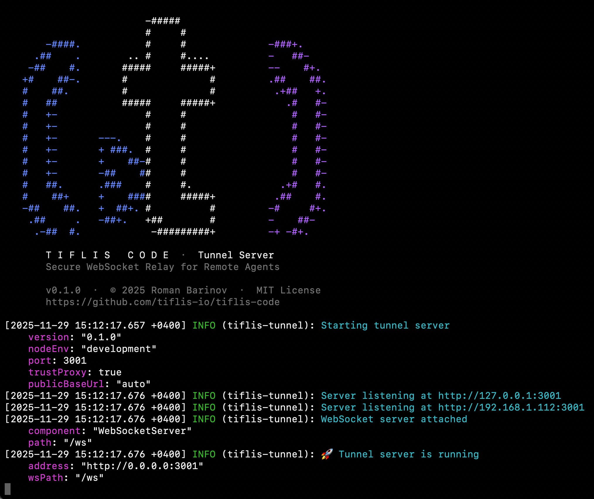
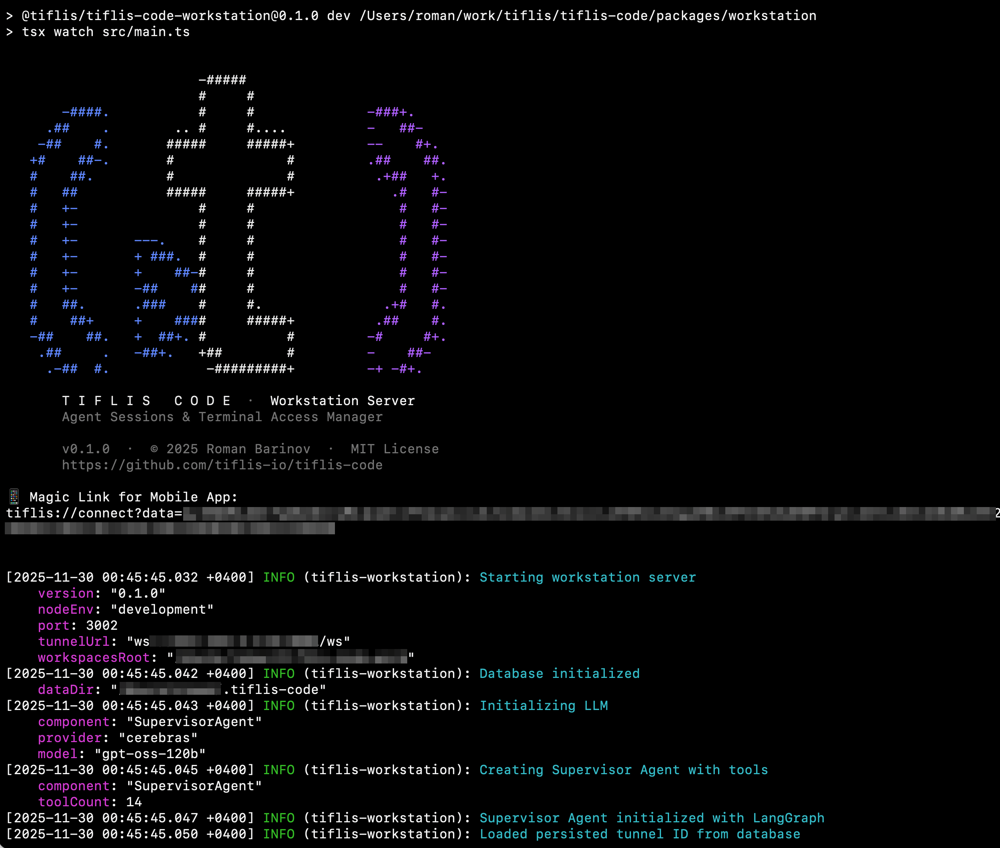

<p align="center">
  
</p>

<h1 align="center">Tiflis Code</h1>

<p align="center">
  <strong>Your AI coding assistants, in your pocket.</strong><br>
  <em>Voice-control Cursor, Claude Code & OpenCode from iPhone, Android, and Apple Watch — anywhere.</em>
</p>

<p align="center">
  <a href="#-why-tiflis-code">Why</a> •
  <a href="#-features">Features</a> •
  <a href="#-architecture">Architecture</a> •
  <a href="#-getting-started">Getting Started</a> •
  <a href="#-use-cases">Use Cases</a> •
  <a href="#-documentation">Docs</a>
</p>

<p align="center">
  
  
  
  
  
  
  
  
</p>

---

## 🎯 Why Tiflis Code?

Modern AI coding assistants like **Cursor**, **Claude Code**, and **OpenCode** are powerful — but they're tied to your workstation. What if you could:

- 🚶 **Dictate a refactoring task** while walking to lunch
- 🚗 **Check agent progress** from your car (parked, of course!)
- ⌚ **Fire off a quick fix** with a voice command from your Apple Watch
- 🛋️ **Monitor long-running tasks** from the couch

**Tiflis Code makes this possible** — without exposing your workstation to the internet or trusting third-party cloud services with your code.

### The Problem

```
You: *away from desk*
AI Agent: *waiting for your input*
Important Task: *blocked*
```

### The Solution

```
You: *on your phone* "Hey, fix that linting error in auth.ts"
AI Agent: *working*
You: *gets audio response* "Done! Fixed 3 ESLint warnings."
```

---

## ✨ Features

### 🎤 Voice-First Experience

| Capability         | Description                                              |
| ------------------ | -------------------------------------------------------- |
| **Speech-to-Text** | Dictate commands naturally — no typing on tiny keyboards |
| **Text-to-Speech** | Hear agent responses read aloud                          |
| **Push-to-Talk**   | Hold to record, release to send                          |
| **Tap Toggle**     | Tap to start, tap again to stop                          |

### 🤖 Multi-Agent Support

Run multiple AI agents simultaneously, each in its own session:

<table align="center">
  <tr>
    <td align="center">
      <br>
      <strong>Cursor</strong><br>
      <code>cursor-agent -p</code>
    </td>
    <td align="center">
      <br>
      <strong>Claude Code</strong><br>
      <code>claude -p</code>
    </td>
    <td align="center">
      <br>
      <strong>OpenCode</strong><br>
      <code>opencode run</code>
    </td>
  </tr>
</table>

**Example workflow:**

- Session 1: Claude Code refactoring `api/` module
- Session 2: Cursor implementing new feature in `frontend/`
- Session 3: OpenCode writing tests

All monitored from your iPhone. Switch between them instantly.

### 💻 Full Terminal Access

Not everything needs an AI. Sometimes you just need to:

```bash
git status
npm run build
tail -f logs/app.log
```

Tiflis Code includes a **complete PTY terminal** on your phone — with full ANSI support, scrollback, and keyboard input.

### 📱 Native Mobile Experience

| Platform        | Features                                                    | Status    |
| --------------- | ----------------------------------------------------------- | --------- |
| **iPhone**      | Full chat UI, terminal, voice recording, sidebar navigation | ✅ Ready  |
| **iPad**        | Optimized layout with persistent sidebar                    | ✅ Ready  |
| **Android**     | Full chat UI, voice I/O, adaptive layout, deep linking      | ✅ Ready  |
| **Apple Watch** | Voice commands, session list, audio responses               | 🚧 WIP    |

Built with **SwiftUI** (iOS/watchOS) and **Jetpack Compose** (Android). Supports light & dark modes.

### 🔐 Privacy & Security

| Aspect               | Implementation                              |
| -------------------- | ------------------------------------------- |
| **Self-Hosted**      | All components run on your infrastructure   |
| **No Cloud**         | Code never leaves your workstation          |
| **End-to-End**       | WSS encryption between all components       |
| **Auth Keys**        | Workstation protected by authentication key |
| **Stateless Tunnel** | Relay server stores nothing — pure proxy    |

---

## 🏗️ Architecture

### System Overview

```
┌─────────────────────────────────────────────────────────────────────────┐
│                                                                         │
│  ┌─────────────┐                                     ┌───────────────┐  │
│  │   iPhone    │         ┌─────────────┐             │               │  │
│  │   Android   │◄───────►│             │◄───────────►│  Workstation  │  │
│  │             │   WSS   │   Tunnel    │    WSS      │    Server     │  │
│  └─────────────┘         │   Server    │             │               │  │
│                          │             │             │  ┌─────────┐  │  │
│  ┌─────────────┐         │  (Your VPS) │             │  │ Claude  │  │  │
│  │             │  HTTP   │             │             │  │ Cursor  │  │  │
│  │ Apple Watch │◄───────►│             │             │  │OpenCode │  │  │
│  │             │ Polling └─────────────┘             │  └─────────┘  │  │
│  └─────────────┘                                     │               │  │
│                                                      │  (Your Mac)   │  │
│  Anywhere in the world                               └───────────────┘  │
│                                                                         │
└─────────────────────────────────────────────────────────────────────────┘
```

### Components

| Component              | Description                  | Technology               |
| ---------------------- | ---------------------------- | ------------------------ |
| **iOS App**            | iPhone & iPad client         | Swift, SwiftUI           |
| **watchOS App**        | Apple Watch companion (WIP)  | Swift, SwiftUI           |
| **Android App**        | Android client               | Kotlin, Jetpack Compose  |
| **Tunnel Server**      | Secure relay (deploy on VPS) | TypeScript, Node.js      |
| **Workstation Server** | Runs on your machine         | TypeScript, Node.js      |

### How It Works

1. **Workstation Server** registers with Tunnel Server using API key
2. **Mobile App** connects to Tunnel using workstation's auth key
3. **Tunnel** relays messages bidirectionally — stores nothing
4. **Voice commands** are transcribed on workstation (STT)
5. **Agent responses** are synthesized to audio (TTS)
6. **Sessions persist** through disconnections

---

## 🚀 Getting Started

### Prerequisites

| Requirement | Version         |
| ----------- | --------------- |
| macOS       | 15.0+ (Sequoia) |
| Xcode       | 16.1+           |
| Node.js     | 22 LTS          |
| pnpm        | 9.0+            |

### Installation

```bash
# Clone the repository
git clone https://github.com/tiflis-io/tiflis-code.git
cd tiflis-code

# Install dependencies
pnpm install

# Build all packages
pnpm build
```

### Running Locally

#### 1. Start Tunnel Server

```bash
cd packages/tunnel
cp .env.example .env.local
# Edit .env.local with your settings
pnpm dev
```

<p align="center">
  
</p>

#### 2. Start Workstation Server

```bash
cd packages/workstation
cp .env.example .env.local
# Edit .env.local:
#   TUNNEL_URL=ws://localhost:3001/ws
#   WORKSTATION_AUTH_KEY=your-secret-key
pnpm dev
```

<p align="center">
  
</p>

#### 3. Run iOS App

```bash
open apps/TiflisCode/TiflisCode.xcodeproj
# Select iPhone 16 Pro simulator
# Press ⌘R to build and run
```

#### 4. Connect

1. Open Settings in the app
2. Enter Tunnel URL: `ws://localhost:3001/ws`
3. Enter Auth Key: (same as `WORKSTATION_AUTH_KEY`)
4. Tap Connect

---

## 💡 Use Cases

### 🚇 The Commuter

> "I spend 45 minutes on the subway. Now I can review what my agents did overnight and queue up new tasks — all by voice."

**Workflow:**

1. Check agent session status
2. Listen to summary of completed work
3. Dictate new tasks for each agent
4. Arrive at office with work already in progress

### 🏃 The Multitasker

> "I run three different projects. Each has its own agent session. I switch between them on my phone while my workstation handles the heavy lifting."

**Workflow:**

- Claude Code: Refactoring legacy module
- Cursor: Building new feature
- OpenCode: Writing integration tests

All running in parallel. All monitored from one app.

### ⌚ The Quick Responder

> "Client reports a bug. I'm at lunch. I pull up my watch, say 'Fix the null check in UserService line 42', and it's done before I finish my coffee."

**Workflow:**

1. Raise wrist
2. Tap Tiflis Code
3. Voice command
4. Done

### 🏠 The Remote Monitor

> "I kicked off a major refactoring before leaving the office. Now I can monitor progress from home and intervene if the agent gets stuck."

**Workflow:**

1. Start long-running task at workstation
2. Leave office
3. Monitor from phone
4. Get audio notifications on completion

---

## 📁 Project Structure

```
tiflis-code/
├── apps/
│   └── TiflisCode/              # iOS & watchOS app (Xcode)
├── packages/
│   ├── tunnel/                  # Tunnel Server
│   ├── workstation/             # Workstation Server
│   └── protocol/                # Shared protocol types
├── assets/
│   └── branding/                # Logos and icons
├── CLAUDE.md                    # Complete project guide
└── PROTOCOL.md                  # WebSocket protocol spec
```

---

## 📖 Documentation

| Document                   | Description                                                   |
| -------------------------- | ------------------------------------------------------------- |
| [CLAUDE.md](CLAUDE.md)     | Complete development guide — architecture, setup, conventions |
| [PROTOCOL.md](PROTOCOL.md) | WebSocket protocol specification                              |

---

## 🛠️ Development

### Commands

```bash
pnpm dev          # Start all servers in dev mode
pnpm build        # Build all packages
pnpm test         # Run tests
pnpm lint         # Lint code
pnpm typecheck    # TypeScript type checking
```

### Tech Stack

| Layer        | Technology                            |
| ------------ | ------------------------------------- |
| **Mobile**   | Swift 5.x, SwiftUI, Swift Concurrency |
| **Server**   | TypeScript 5.x, Node.js 22, Fastify   |
| **Protocol** | WebSocket, Zod validation             |
| **Database** | SQLite (workstation only)             |
| **Build**    | Turborepo, pnpm, tsup                 |

---

## 🤝 Contributing

Contributions are welcome! Please read the development guidelines in [CLAUDE.md](CLAUDE.md) before submitting PRs.

- Follow [Conventional Commits](https://www.conventionalcommits.org/)
- All code and comments in English
- Include tests for new features

---

## 📜 License

**FSL-1.1-NC** © 2025 [Roman Barinov](mailto:rbarinov@gmail.com)

See [LICENSE](LICENSE) for details.

---

<p align="center">
  <strong>Built with ❤️ for developers who code on the go.</strong>
</p>
