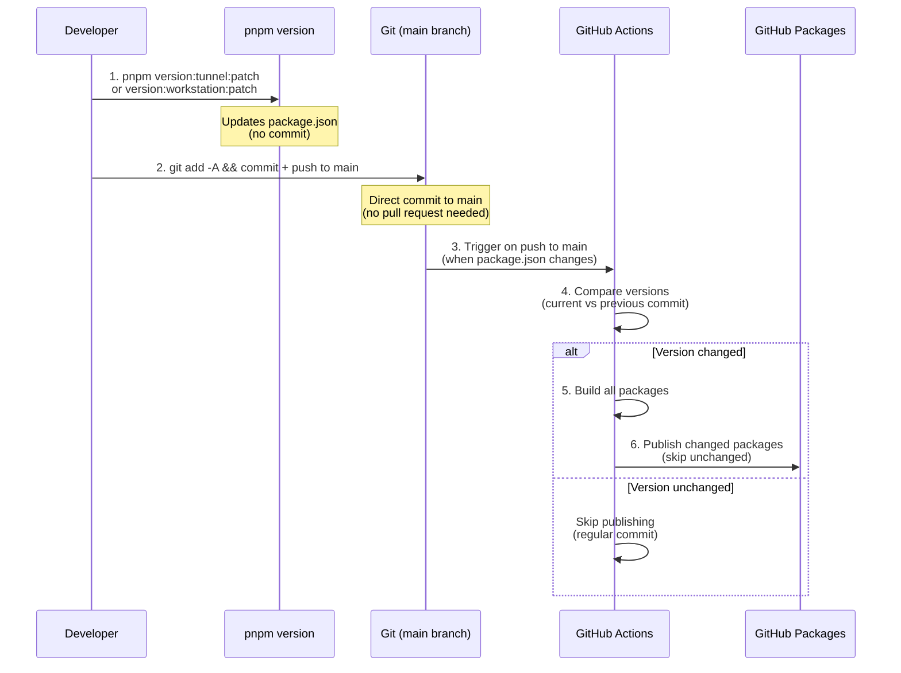

# CI/CD and Release Process

> Complete guide for continuous integration, deployment, and release management.

**Last Updated:** 2025-12-03

---

## Overview

The project uses GitHub Actions for CI/CD with automatic publishing to GitHub Packages when versions change.

---

## Monorepo Structure

```
tiflis-code/
├── .github/
│   └── workflows/
│       ├── ci.yml                       # CI pipeline (lint, typecheck, build, test)
│       ├── release.yml                  # Server packages release
│       └── release-ios.yml              # iOS/watchOS release
│
├── apps/
│   └── TiflisCode/                      # Xcode project (iOS + watchOS)
│
├── packages/
│   ├── tunnel/                          # @tiflis-io/tiflis-code-tunnel
│   └── workstation/                     # @tiflis-io/tiflis-code-workstation
│
├── turbo.json                           # Turborepo config
├── pnpm-workspace.yaml
└── package.json                         # Root package.json
```

---

## Versioning Strategy

### Protocol-First Versioning

All components maintain **protocol compatibility**. The protocol version is the coordination point:

```typescript
// packages/protocol/src/version.ts
export const PROTOCOL_VERSION = {
  major: 1,
  minor: 0,

  isCompatible(other: { major: number; minor: number }): boolean {
    return this.major === other.major && this.minor >= other.minor;
  },
};
```

### Version Matrix

| Component                              | Versioning           | Release Trigger                                        |
| -------------------------------------- | -------------------- | ------------------------------------------------------ |
| **@tiflis-io/tiflis-code-protocol**    | Independent semver   | Protocol changes                                       |
| **@tiflis-io/tiflis-code-tunnel**      | Independent semver   | Tunnel changes (via `pnpm version:tunnel:*`)           |
| **@tiflis-io/tiflis-code-workstation** | Independent semver   | Workstation changes (via `pnpm version:workstation:*`) |
| **TiflisCode iOS**                     | App Store versioning | App changes (manual workflow)                          |
| **TiflisCodeWatch**                    | Bundled with iOS app | Same as iOS                                            |

### Breaking Change Rules

| Change Type                          | Protocol Version | Component Action               |
| ------------------------------------ | ---------------- | ------------------------------ |
| **Additive** (new optional field)    | Minor bump       | Optional update                |
| **Breaking** (removed/changed field) | Major bump       | **All components must update** |
| **Internal** (implementation only)   | Patch bump       | Independent update             |

### Semantic Versioning Rules

| Component       | When to bump MAJOR               | When to bump MINOR                 | When to bump PATCH |
| --------------- | -------------------------------- | ---------------------------------- | ------------------ |
| **protocol**    | Breaking protocol changes        | New message types, optional fields | Bug fixes, docs    |
| **tunnel**      | Breaking API changes             | New features                       | Bug fixes          |
| **workstation** | Breaking API changes             | New features, new agent support    | Bug fixes          |
| **iOS app**     | Major redesign, breaking changes | New features                       | Bug fixes          |

### Git Tags Convention

| Component   | Tag Format               | Example              |
| ----------- | ------------------------ | -------------------- |
| Protocol    | `protocol-v{version}`    | `protocol-v1.2.0`    |
| Tunnel      | `tunnel-v{version}`      | `tunnel-v1.5.2`      |
| Workstation | `workstation-v{version}` | `workstation-v1.3.1` |
| iOS         | `ios-v{version}-{build}` | `ios-v1.2.0-42`      |

---

## Release Process (Simple Version Bump)

The project uses a **simple version bump** strategy. Developers commit directly to `main` branch. Packages are published automatically only when version changes in `package.json`.

### Version Bump Commands

```bash
# For tunnel server
pnpm version:tunnel:patch    # 0.1.8 → 0.1.9
pnpm version:tunnel:minor    # 0.1.8 → 0.2.0
pnpm version:tunnel:major    # 0.1.8 → 1.0.0

# For workstation server
pnpm version:workstation:patch   # 0.1.1 → 0.1.2
pnpm version:workstation:minor   # 0.1.1 → 0.2.0
pnpm version:workstation:major   # 0.1.1 → 1.0.0
```

**What these commands do:**

- Update version in `package.json` using `npm version` command
- Use `--no-git-tag-version` flag to prevent automatic git tag creation
- **Do NOT create commit automatically** — you commit manually
- **Do NOT push automatically** — you push manually

### Release Workflow

```bash
# 1. Update version using command
pnpm version:workstation:patch

# 2. Add any other changes and commit
git add -A
git commit -m "chore(workstation): bump version to 0.1.2"

# 3. Push directly to main
git push origin main

# 4. GitHub Actions automatically:
#    - Triggers on push to main when package.json files change
#    - Compares current version with previous commit
#    - Builds all packages
#    - Publishes only packages with changed versions to GitHub Packages
#    - Skips packages with unchanged versions
```

**Important:**

- ✅ Commit directly to `main` — no pull requests required
- ✅ Regular commits (without version changes) don't trigger publishing
- ✅ Only packages with version changes are published
- ✅ All packages in `packages/*` are automatically checked
- ✅ Workflow triggers only when `packages/**/package.json` files change

### Release Flow Diagram



---

## Turborepo Configuration

```json
// turbo.json
{
  "$schema": "https://turbo.build/schema.json",
  "globalDependencies": ["**/.env.*local"],
  "pipeline": {
    "build": {
      "dependsOn": ["^build"],
      "outputs": ["dist/**"],
      "cache": true
    },
    "test": {
      "dependsOn": ["build"],
      "cache": true
    },
    "lint": {
      "cache": true
    },
    "typecheck": {
      "dependsOn": ["^build"],
      "cache": true
    },
    "dev": {
      "cache": false,
      "persistent": true
    }
  }
}
```

---

## GitHub Actions Workflows

### CI Pipeline

```yaml
# .github/workflows/ci.yml
name: CI

on:
  push:
    branches: [main]

concurrency:
  group: ${{ github.workflow }}-${{ github.ref }}
  cancel-in-progress: true

jobs:
  # ─────────────────────────────────────────────────────────────
  # TypeScript Packages
  # ─────────────────────────────────────────────────────────────
  typescript:
    name: TypeScript CI
    runs-on: ubuntu-latest

    steps:
      - name: Checkout repository
        uses: actions/checkout@v4

      - name: Setup pnpm
        uses: pnpm/action-setup@v4

      - name: Setup Node.js
        uses: actions/setup-node@v4
        with:
          node-version: 22
          cache: "pnpm"

      - name: Install dependencies
        run: pnpm install --frozen-lockfile

      - name: Lint
        run: pnpm --filter "@tiflis-io/tiflis-code-tunnel" lint

      - name: Type check
        run: pnpm --filter "@tiflis-io/tiflis-code-tunnel" typecheck

      - name: Build
        run: pnpm --filter "@tiflis-io/tiflis-code-tunnel" build

      - name: Test
        run: pnpm --filter "@tiflis-io/tiflis-code-tunnel" test

  # ─────────────────────────────────────────────────────────────
  # Docker Build Test (no push, just verify it builds)
  # ─────────────────────────────────────────────────────────────
  docker-build-test:
    name: Docker Build Test
    runs-on: ubuntu-latest
    needs: typescript

    steps:
      - name: Checkout repository
        uses: actions/checkout@v4

      - name: Set up Docker Buildx
        uses: docker/setup-buildx-action@v3

      - name: Build Docker image (test only)
        uses: docker/build-push-action@v6
        with:
          context: .
          file: ./packages/tunnel/Dockerfile
          platforms: linux/amd64
          push: false
          tags: tiflis-code-tunnel:test
          cache-from: type=gha
          cache-to: type=gha,mode=max
```

### Server Packages Release

```yaml
# .github/workflows/release.yml
name: Release

on:
  push:
    branches: [main]
    paths:
      - "packages/**/package.json"

jobs:
  publish:
    name: Publish Changed Packages
    runs-on: ubuntu-latest
    permissions:
      contents: write
      packages: write

    steps:
      - uses: actions/checkout@v4
        with:
          fetch-depth: 2 # Need previous commit to compare versions

      - uses: pnpm/action-setup@v4

      - uses: actions/setup-node@v4
        with:
          node-version: 22
          cache: "pnpm"
          registry-url: "https://npm.pkg.github.com"
          scope: "@tiflis-io"

      - run: pnpm install --frozen-lockfile
      - run: pnpm build

      - name: Publish packages with version changes
        run: |
          for pkg in packages/*/; do
            if [ -f "$pkg/package.json" ]; then
              PKG_NAME=$(basename $pkg)
              CURRENT_VERSION=$(node -p "require('./$pkg/package.json').version")
              PREVIOUS_VERSION=$(git show HEAD~1:$pkg/package.json 2>/dev/null | node -p "JSON.parse(require('fs').readFileSync(0, 'utf-8')).version" 2>/dev/null || echo "")
              
              if [ -z "$PREVIOUS_VERSION" ] || [ "$CURRENT_VERSION" != "$PREVIOUS_VERSION" ]; then
                echo "📦 Publishing $PKG_NAME@$CURRENT_VERSION (was: ${PREVIOUS_VERSION:-none})"
                cd "$pkg"
                pnpm publish --no-git-checks --access public || echo "⚠️ Failed to publish $PKG_NAME"
                cd ../..
              else
                echo "⏭️  Skipping $PKG_NAME@$CURRENT_VERSION (version unchanged)"
              fi
            fi
          done
        env:
          NODE_AUTH_TOKEN: ${{ secrets.GITHUB_TOKEN }}
```

**Key Features:**

- **Automatic version detection**: Compares current version with previous commit
- **Smart publishing**: Only publishes packages with changed versions
- **No false triggers**: Regular commits (without version changes) don't trigger publishing
- **All packages**: Automatically finds and publishes all packages in `packages/`
- **Error handling**: Continues publishing other packages if one fails

### iOS/watchOS Release (with Fastlane)

```yaml
# .github/workflows/release-ios.yml
name: Release iOS

on:
  workflow_dispatch:
    inputs:
      version:
        description: "Version number (e.g., 1.2.0)"
        required: true
      build_number:
        description: "Build number"
        required: true

jobs:
  release:
    name: Build and Release to TestFlight
    runs-on: macos-14

    steps:
      - uses: actions/checkout@v4

      - name: Select Xcode
        run: sudo xcode-select -s /Applications/Xcode_16.1.app

      - name: Setup Ruby
        uses: ruby/setup-ruby@v1
        with:
          ruby-version: "3.2"
          bundler-cache: true
          working-directory: apps/TiflisCode

      - name: Install CocoaPods (if needed)
        run: |
          cd apps/TiflisCode
          bundle install

      - name: Setup certificates
        env:
          MATCH_PASSWORD: ${{ secrets.MATCH_PASSWORD }}
          MATCH_GIT_URL: ${{ secrets.MATCH_GIT_URL }}
          MATCH_GIT_BASIC_AUTHORIZATION: ${{ secrets.MATCH_GIT_BASIC_AUTHORIZATION }}
        run: |
          cd apps/TiflisCode
          bundle exec fastlane match appstore --readonly

      - name: Build and upload to TestFlight
        env:
          APP_STORE_CONNECT_API_KEY_ID: ${{ secrets.ASC_KEY_ID }}
          APP_STORE_CONNECT_API_ISSUER_ID: ${{ secrets.ASC_ISSUER_ID }}
          APP_STORE_CONNECT_API_KEY: ${{ secrets.ASC_KEY }}
          VERSION: ${{ github.event.inputs.version }}
          BUILD_NUMBER: ${{ github.event.inputs.build_number }}
        run: |
          cd apps/TiflisCode
          bundle exec fastlane release version:$VERSION build:$BUILD_NUMBER
```

---

## Fastlane Configuration

```ruby
# apps/TiflisCode/fastlane/Fastfile
default_platform(:ios)

platform :ios do
  desc "Build and upload to TestFlight"
  lane :release do |options|
    version = options[:version]
    build = options[:build]

    # Update version numbers
    increment_version_number(
      version_number: version,
      xcodeproj: "TiflisCode.xcodeproj"
    )

    increment_build_number(
      build_number: build,
      xcodeproj: "TiflisCode.xcodeproj"
    )

    # Build iOS app
    build_app(
      scheme: "TiflisCode",
      export_method: "app-store",
      output_directory: "./build",
      include_symbols: true,
      include_bitcode: false
    )

    # Upload to TestFlight
    upload_to_testflight(
      skip_waiting_for_build_processing: true,
      api_key: app_store_connect_api_key
    )

    # Create git tag
    add_git_tag(tag: "ios-v#{version}-#{build}")
    push_git_tags
  end

  desc "Run tests"
  lane :test do
    run_tests(
      scheme: "TiflisCode",
      devices: ["iPhone 16 Pro"],
      code_coverage: true
    )
  end
end
```

---

## Package.json Scripts

```json
// package.json (root)
{
  "name": "tiflis-code",
  "private": true,
  "scripts": {
    "build": "pnpm -r build",
    "dev": "pnpm -r --parallel dev",
    "test": "pnpm -r test",
    "lint": "pnpm -r lint",
    "typecheck": "pnpm -r typecheck",
    "clean": "pnpm -r clean && rm -rf node_modules",
    "version:tunnel:patch": "cd packages/tunnel && npm version patch --no-git-tag-version",
    "version:tunnel:minor": "cd packages/tunnel && npm version minor --no-git-tag-version",
    "version:tunnel:major": "cd packages/tunnel && npm version major --no-git-tag-version",
    "version:workstation:patch": "cd packages/workstation && npm version patch --no-git-tag-version",
    "version:workstation:minor": "cd packages/workstation && npm version minor --no-git-tag-version",
    "version:workstation:major": "cd packages/workstation && npm version major --no-git-tag-version"
  },
  "packageManager": "pnpm@9.15.0",
  "engines": {
    "node": ">=22.0.0",
    "pnpm": ">=9.0.0"
  }
}
```

```yaml
# pnpm-workspace.yaml
packages:
  - "packages/*"
```

---

## GitHub Packages Publishing

All npm packages are published to **GitHub Packages** (not npmjs.com).

### Package Configuration

```json
// packages/*/package.json
{
  "name": "@tiflis-io/tiflis-code-tunnel",
  "publishConfig": {
    "registry": "https://npm.pkg.github.com",
    "access": "public"
  }
}
```

**Package Scope:** All packages use the `@tiflis-io` scope to match the GitHub organization name (`tiflis-io`).

### npm Registry Configuration

```
# .npmrc (repository root)
@tiflis-io:registry=https://npm.pkg.github.com
```

### Installing from GitHub Packages

Users need to authenticate with GitHub Packages:

```bash
# Add to ~/.npmrc (with personal access token)
//npm.pkg.github.com/:_authToken=YOUR_GITHUB_TOKEN
@tiflis-io:registry=https://npm.pkg.github.com
```

Then install:

```bash
npm install @tiflis-io/tiflis-code-tunnel
```

---

## References

- [docs/RELEASE_SIMPLE.md](RELEASE_SIMPLE.md) — Simplified release guide
- [GitHub Actions Documentation](https://docs.github.com/en/actions)
- [Fastlane Documentation](https://docs.fastlane.tools/)
- [GitHub Packages Documentation](https://docs.github.com/en/packages)
- [Turborepo Documentation](https://turbo.build/repo/docs)
