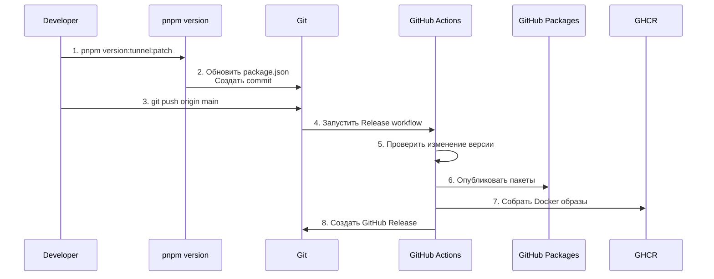

# Процесс релиза (Manual Version Bump)

## Простой процесс релиза

### Шаг 1: Обновить версию через команду

```bash
# Для tunnel server
pnpm version:tunnel:patch    # 0.1.1 → 0.1.2
pnpm version:tunnel:minor    # 0.1.1 → 0.2.0
pnpm version:tunnel:major   # 0.1.1 → 1.0.0

# Для workstation server
pnpm version:workstation:patch
pnpm version:workstation:minor
pnpm version:workstation:major
```

**Что делает команда:**
- Обновляет версию в `package.json`
- Создает git commit с сообщением типа `chore(tunnel): bump version to 0.1.2`
- **НЕ пушит автоматически** - нужно сделать push вручную

### Шаг 2: Закоммитить и запушить

```bash
git push origin main
```

### Шаг 3: GitHub Actions автоматически

1. ✅ Обнаружит изменение версии
2. ✅ Опубликует пакеты в GitHub Packages
3. ✅ Соберет Docker образы
4. ✅ Создаст GitHub Release

---

## Пример полного релиза

```bash
# 1. Обновить версию tunnel (patch)
pnpm version:tunnel:patch

# 2. Проверить изменения
git status
git log -1

# 3. Запушить
git push origin main

# 4. GitHub Actions автоматически:
#    - Обнаружит версию 0.1.1 → 0.1.2
#    - Опубликует @tiflis-io/tiflis-code-tunnel@0.1.2
#    - Соберет Docker образ
#    - Создаст Release
```

---

## Доступные команды

| Команда | Описание |
|---------|----------|
| `pnpm version:tunnel:patch` | Увеличить patch версию tunnel (0.1.1 → 0.1.2) |
| `pnpm version:tunnel:minor` | Увеличить minor версию tunnel (0.1.1 → 0.2.0) |
| `pnpm version:tunnel:major` | Увеличить major версию tunnel (0.1.1 → 1.0.0) |
| `pnpm version:workstation:patch` | Увеличить patch версию workstation |
| `pnpm version:workstation:minor` | Увеличить minor версию workstation |
| `pnpm version:workstation:major` | Увеличить major версию workstation |

---

## Семантическое версионирование

- **Patch** (0.1.1 → 0.1.2): Исправления багов, мелкие изменения
- **Minor** (0.1.1 → 0.2.0): Новые функции, обратно совместимые изменения
- **Major** (0.1.1 → 1.0.0): Breaking changes, крупные изменения

---

## Диаграмма процесса



