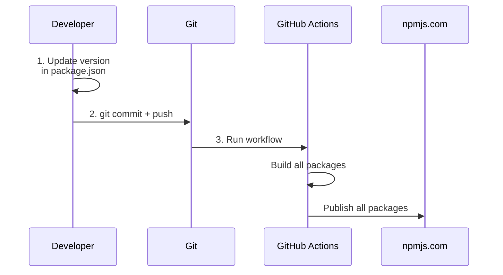

# Simple Release Process

## Process (3 steps for any package)



## Steps

### 1. Update Version

```bash
# Tunnel server
pnpm version:tunnel:patch   # 0.1.7 → 0.1.8
pnpm version:tunnel:minor   # 0.1.7 → 0.2.0
pnpm version:tunnel:major   # 0.1.7 → 1.0.0

# Workstation server
pnpm version:workstation:patch   # 0.1.2 → 0.1.3
pnpm version:workstation:minor   # 0.1.2 → 0.2.0
pnpm version:workstation:major   # 0.1.2 → 1.0.0
```

### 2. Commit and Push

```bash
git add packages/*/package.json
git commit -m "chore: bump version"
git push origin main
```

### 3. Automatic

GitHub Actions:
- ✅ Will build all packages
- ✅ Will publish all packages to npmjs.com

**That's it. Nothing else.**

---

## What Gets Published

All packages from `packages/`:
- `@tiflis-io/tiflis-code-tunnel`
- `@tiflis-io/tiflis-code-workstation`

The workflow automatically finds all `package.json` files in `packages/` and publishes them.

---

## Unified Process

Same process for all server components:
1. Update version → 2. Commit → 3. Push → 4. Automatic publish

No differences, no complexity.