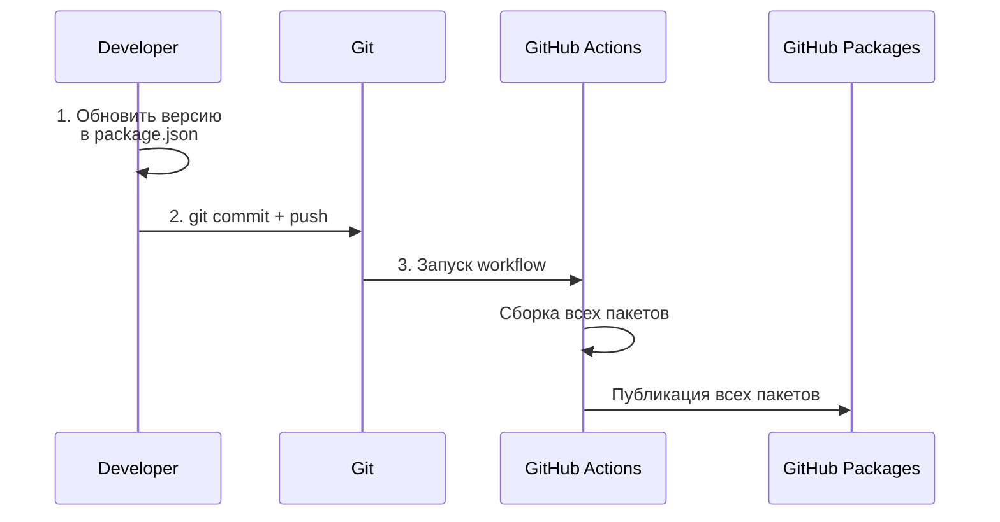

# Простая схема релиза

## Процесс (3 шага для любого пакета)


```mermaid
sequenceDiagram
    participant Dev as Developer
    participant Git as Git
    participant CI as GitHub Actions
    participant NPM as GitHub Packages

    Dev->>Dev: 1. Обновить версию<br/>в package.json
    Dev->>Git: 2. git commit + push
    Git->>CI: 3. Запуск workflow
    CI->>CI: Сборка всех пакетов
    CI->>NPM: Публикация всех пакетов
```

## Шаги

### 1. Обновить версию

```bash
# Tunnel server
pnpm version:tunnel:patch   # 0.1.7 → 0.1.8
pnpm version:tunnel:minor   # 0.1.7 → 0.2.0
pnpm version:tunnel:major   # 0.1.7 → 1.0.0

# Workstation server
pnpm version:workstation:patch   # 0.1.2 → 0.1.3
pnpm version:workstation:minor   # 0.1.2 → 0.2.0
pnpm version:workstation:major   # 0.1.2 → 1.0.0
```

### 2. Закоммитить и запушить

```bash
git add packages/*/package.json
git commit -m "chore: bump version"
git push origin main
```

### 3. Автоматически

GitHub Actions:
- ✅ Соберет все пакеты
- ✅ Опубликует все пакеты в GitHub Packages

**Всё. Больше ничего.**

---

## Что публикуется

Все пакеты из `packages/`:
- `@tiflis-io/tiflis-code-tunnel`
- `@tiflis-io/tiflis-code-workstation`

Workflow автоматически находит все `package.json` в `packages/` и публикует их.

---

## Единая схема

Одинаковый процесс для всех серверных компонентов:
1. Обновить версию → 2. Commit → 3. Push → 4. Автоматическая публикация

Никаких различий, никаких условий, никакой сложности.
