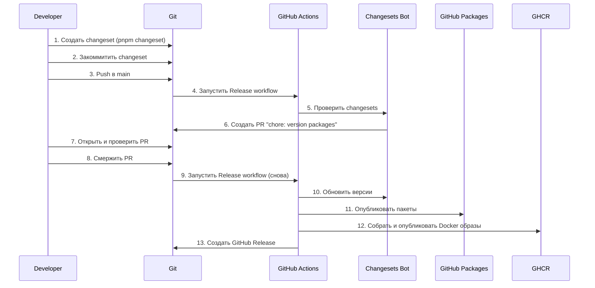
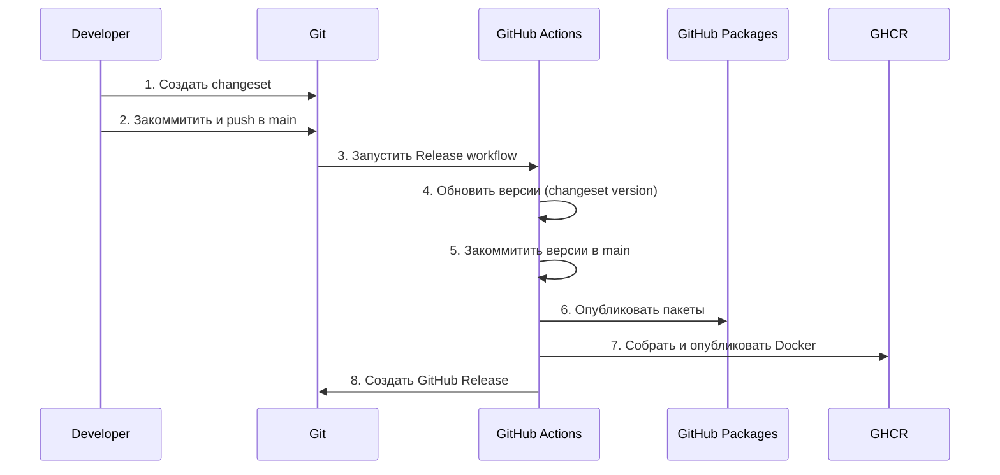
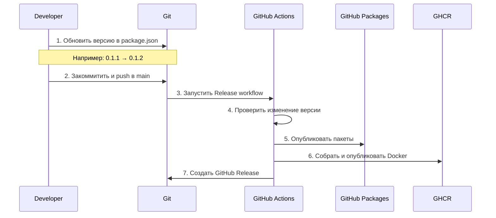
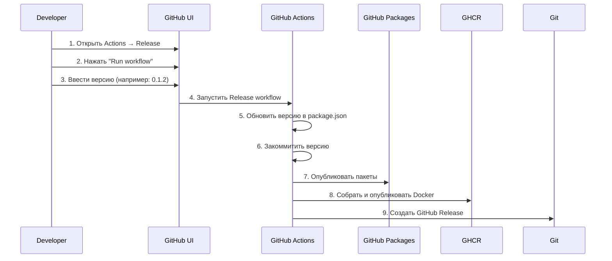

# Упрощение процесса релиза

## Текущий процесс (сложный)

**Проблемы:**
- 13 шагов
- 2 запуска workflow
- Ручной мердж PR
- Долгое ожидание

---

## Вариант 1: Прямая публикация (рекомендуется)

**Идея:** Если есть changesets, сразу публиковать без создания PR.

**Преимущества:**
- ✅ 8 шагов вместо 13
- ✅ 1 запуск workflow
- ✅ Нет ручного мерджа PR
- ✅ Быстрее в 2 раза

**Недостатки:**
- ⚠️ Версии обновляются автоматически (но это можно контролировать через changesets)

---

## Вариант 2: Manual version bump

**Идея:** Просто обновить версию в `package.json` вручную, workflow опубликует.

**Преимущества:**
- ✅ 7 шагов
- ✅ Полный контроль версий
- ✅ Простота
- ✅ Нет зависимости от changesets

**Недостатки:**
- ⚠️ Нужно вручную обновлять версии
- ⚠️ Нет автоматического changelog

---

## Вариант 3: Workflow dispatch с версией

**Идея:** Запускать релиз вручную через GitHub UI, указывая версию.

**Преимущества:**
- ✅ Полный контроль
- ✅ Можно релизить в любое время
- ✅ Нет необходимости в changesets

**Недостатки:**
- ⚠️ Нужно помнить обновлять версию
- ⚠️ Нет автоматического changelog

---

## Рекомендация: Вариант 1 (Прямая публикация)

**Почему:**
- Сохраняет преимущества changesets (changelog, контроль версий)
- Убирает лишние шаги (PR, мердж)
- Автоматизирует процесс
- Быстрее и проще

**Что нужно изменить:**
- Убрать создание PR из changesets action
- Публиковать сразу после обновления версий
- Коммитить версии обратно в main

---

## Сравнение вариантов

| Критерий | Текущий | Вариант 1 | Вариант 2 | Вариант 3 |
|----------|---------|-----------|-----------|-----------|
| **Шагов** | 13 | 8 | 7 | 9 |
| **Ручной мердж PR** | ✅ Да | ❌ Нет | ❌ Нет | ❌ Нет |
| **Автоматический changelog** | ✅ Да | ✅ Да | ❌ Нет | ❌ Нет |
| **Контроль версий** | ✅ Да | ✅ Да | ⚠️ Ручной | ⚠️ Ручной |
| **Скорость** | 🐌 Медленно | ⚡ Быстро | ⚡ Быстро | ⚡ Быстро |
| **Простота** | 😰 Сложно | 😊 Просто | 😊 Просто | 😊 Просто |

